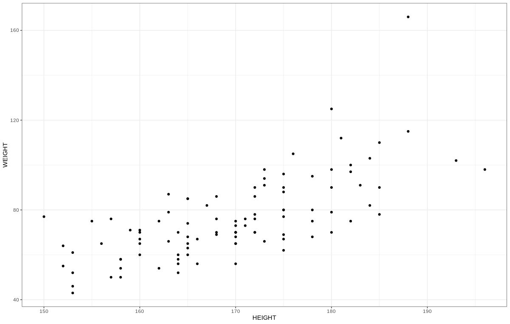

## Pearson Correlation

So far we have compared two groups within the same numeric variable. But what about comparing two different numeric variables? We often accomplish this 
by assessing the **correlation** between the two numeric variables. First we will discuss Pearson Correlation which can be calculated by:

$$ r = \frac{\sum{(x - \mu_x)(y - \mu_y)}}{\sqrt{\sum{(x - \mu_x)^2} \sum{(y - \mu_y)^2}}}  $$ 

!!! example "Explanation of Terms"
    - $r$ : correlation coefficient
    - $x$ : variable x
    - $y$ : variable y
    - $\mu_x$ : mean of variable of x
    - $\mu_y$ : mean of variable of y
    
Pearson Correlation is called **parametric correlation** as it depends on the distribution of your data. This type of correlation is assessing the linear
dependence of variables x and y. We can test the signifcance of this association using the t statistic for pearson correlation:

$$t = \frac{r}{\sqrt{1-r^2}}\sqrt{n - 2}$$

!!! example "Explanation of Terms"
    - $r$ : correlation coefficient
    - $n$ : number of observations
    
## Calculating Pearson Correlation

Using our glioblastoma data, let's determine the correlation between height and weight in our patients. However, before we do this,  let's plot height 
versus weight:

```R
# let's plot height and weight
ggplot(meta,aes(x=HEIGHT,y=WEIGHT))+
  geom_point()+
  theme_bw()
```



Here we see there is a positive relationship between height and weight. Let's test the significance of this relationship:

```R
# test the correlation between height and weight
cor.test(
  x = meta$HEIGHT,
  y = meta$WEIGHT,
  method = "pearson"
)
```

```
	Pearson's product-moment correlation

data:  meta$HEIGHT and meta$WEIGHT
{==t = 9.5779, df = 97, p-value = 1.094e-15==}
alternative hypothesis: true correlation is not equal to 0
95 percent confidence interval:
{== 0.5795233 0.7863597 ==}
sample estimates:
     cor 
{==0.697175 ==}
```

!!! info "Explanation of Results"
    - our test statistic is `9.5779`
    - our d.f. is `97`
    - our p-value is `1.094e-15` giving us enough evidence to reject the null hypothesis that the correlation is equal to 0
    - the alternative hypothesis is that the true correlation is not equal to 0 appears supported
    - the 95% confidence interval around our correlation coefficient is `0.5795233` and `0.7863597`
    - the correlation coefficient is `0.697175` indicating a positive association

!!! example "Correlation Coefficient Interpretation"
    - correlation coefficient = 0 : no association
    - correlation coefficient = 1 : positive assocation
    - correlation coefficient. = -1 : negative associtaion
    
## Pearson Correlation Assumptions

Now that we have conducted our test we must test our assumptions:

 - the relationship is linear
 - is each variable normally distributed?

We saw from our plot that the relationship does appear linear, meaning that as one variable increases/decreases the other does too. To test the normality
of each variable we will use the Shapiro-Wilk Test:

```R
# test the normality of height and weight
shapiro.test(meta$HEIGHT)
shapiro.test(meta$WEIGHT)
```

```
	Shapiro-Wilk normality test

data:  meta$HEIGHT
W = 0.98735, p-value = 0.4689

	Shapiro-Wilk normality test

data:  meta$WEIGHT
W = 0.91388, p-value = 7.436e-06
```

Given our p-value for the Shapiro-Wilk Test on height is above 0.05 we do not have enough evidence to reject the null hypothesis of the Shapiro-Wilk
Test; that the data are normally distributed. However, we note the opposite case for weight. The p-value is below 0.05 which indicates the data are not 
normally distributed.

## Spearman Rank Correlation

Above we saw that the normality assumption was violated in our data. What are we to do! Another option we could pursue is non-parametric correlation 
which does not make the assumptions we discussed above. This correlation coefficient is referred to as **Spearman Rank Correlation** which can be 
calculated like so:


$$ r = \frac{\sum{(x\prime - \mu_{x\prime} )(y\prime  - \mu_{y\prime} )}}{\sqrt{\sum{(x\prime  - \mu_{x\prime} )^2} \sum{(y\prime  - \mu_{y\prime} )^2}}}  $$ 

!!! example "Explanation of Terms"
    - $r$ : spearman rank correlation coefficient
    - $x$ : ranked variable x
    - $y$ : ranked variable y
    - $\mu_x$ : mean of variable of x
    - $\mu_y$ : mean of variable of y
    
Essentially, the only difference is that the values in the variables are ranked and then the correlation coefficient is calculated. Let's try this in R!

```R
# test the spearman correlation between height and weight
cor.test(
  x = meta$HEIGHT,
  y = meta$WEIGHT,
  method = "spearman",
  exact = FALSE
)
```

```
	Spearman's rank correlation rho

data:  meta$HEIGHT and meta$WEIGHT
S = 46676, {==p-value < 2.2e-16==}
alternative hypothesis: true rho is not equal to 0
sample estimates:
      rho 
{==0.7113395==} 
```

!!! info "Explanation of Results"
    - the p-value is less than `2.2e-16`
    - the p-value is below 0.05 giving us enough evidence to reject the null hypothesis, that the true rho is equal to 0
    - the spearman correlation coefficient is `0.7113395` indicative of a positive association
    
    
## References

1. [Correlation Test Between Two Variables in R](http://www.sthda.com/english/wiki/correlation-test-between-two-variables-in-r)
2. [BIOL 202 - Pearson correlation analysis](https://ubco-biology.github.io/BIOL202/pearson.html)
