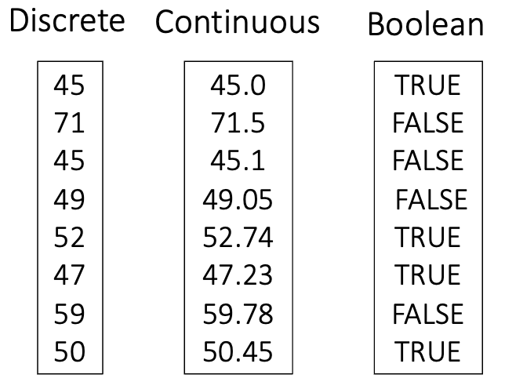

## The Variable, The Probability, And The Distriubtion

Probability can be used to assess the likelihood of getting a value. Multiple values make up a variable, like a set of biomarker values, temperature values, etc.. This variable is related to the probability of getting the value by the probability distribution. Before we get to probability distributions we will talk a bit more about variables, specifically random variables!

!!! info ""

    <figure markdown>
      { width="500"}
      <figcaption></figcaption>
    </figure>

## Random Variables

Random variables are some quantity derived from a random process. Think about drawing some random value from a bag of possible values. That set of possible values can change depending on what you are measuring:

- If you are measuring a variable that exists on a continuous spectrum it is called a **continuous random variable**. Think rainfall, where the values are continous (1,1.1, 1.005,2, etc.)
- If you are measure a variable that is limited to integers, the variable is called a **discrete random variable**. Think of count data like number of shoes, where you cannot have values in between values (2,4,5, etc.)
- If you are measuring a variable that is limited to true or false values, the variable is called a **boolean random variable**. Think of marital status, where the values are limited to yes/no or true/false (True, False)

!!! info ""

    <figure markdown>
      { width="300"}
      <figcaption></figcaption>
    </figure>

## Probability Distributions

For each value in a random variable there is some probability of getting that value. A set of these probabilities is known as the **probability distribution**! These probablities can be calculated using different functions depending on your variable type. Broadly speaking, there are two kinds of probability fucntions:

- **Probability Mass Function** - What is the probabilty of getting that exact value?
- **Cumulative Distribution Function** - What is the probability of getting a value less than or equal to that value?

!!! info ""

    <figure markdown>
      {width="500"}
      <figcaption></figcaption>
    </figure>
    
    
## References

1. [A Gentle Introduction to Probability Distributions](https://machinelearningmastery.com/what-are-probability-distributions/)
2. [Connecting the CDF and the PDF](https://demonstrations.wolfram.com/ConnectingTheCDFAndThePDF/)
