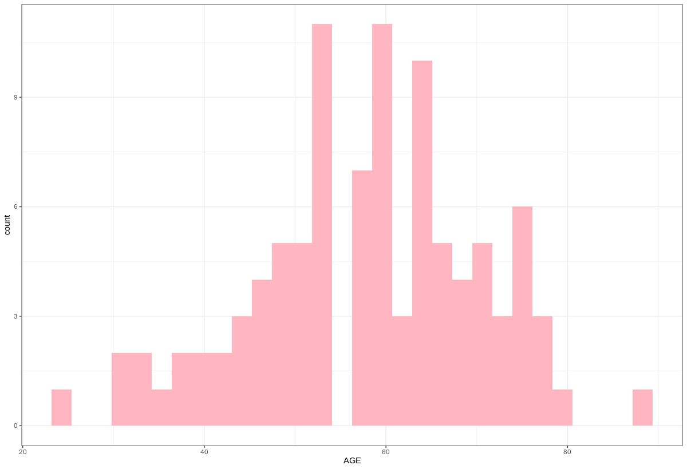

## One-Sample T-Test

When we deal with numeric variables we often examine the mean of that variable. The one-sample t-test can help answer the following questions about our 
numeric variable:

- **Does the mean of our sample, $\mu$, equal the theoretical mean of our population, $\mu_0$?**
    - $H_0: \mu = \mu_0$
    - $H_a: \mu \neq \mu_0$
- **Is the mean of our sample, $\mu$, less than the theoretical mean of our population, $\mu_0$?**
    - $H_0: \mu \le \mu_0$
    - $H_a: \mu > \mu_0$
- **Is the mean of our sample, $\mu$, greater than the theoretical mean of our population, $\mu_0$?**
    - $H_0: \mu \ge \mu_0$
    - $H_a: \mu < \mu_0$

!!! tip
    When we ask if the sample mean is equal to the population mean we are conducting a **two-sided test**. When we ask if the sample mean is less than 
    or greater than the population mean, we are conducting a **one-sided test**.

## Test Statistic

Our one-sample t-test statistic can be calculated by:

$$t = \frac{\mu - \mu_0}{\sigma / \sqrt{n}} $$

$$d.f. = n - 1$$

!!! example "Explanation of Terms"
    - $\mu$ : sample mean
    - $\mu_0$ : theoretical population mean
    - $\sigma$ : standard deviation of our sample
    - $n$ : sample size
    - $d.f.$ : degrees of freedom

## Normal Distribution

Using our glioblastoma data, we are going to ask: Does the mean age of our patients equal the theoretical mean of the U.S. population (Let's say the avearage age is 32)? Before we do so, we need to ask; what probability function are we comparing our test statistic to? For a numeric variable we often compare our test statistic to a Gaussian or normal distribution. The probability density function for the normal distribution has the following formula:

$$f(x) = \frac{1}{(\sigma\sqrt{2 \pi})} e^{-(\frac{(x - \mu)^2}{2 \sigma^2})}$$

!!! example "Explanation of Terms"
    - $\sigma$ : standard deviation
    - $\mu$ : mean

## Confidence Interval

Just like our proportion tests, we also have a confidence interval around our sample parameter, in this case the sample mean. So for a test statistic, $t$, at an $\alpha$ level of 0.05, our confidence interval would be:

$$\mu \pm t \frac{\sigma}{\sqrt{n}}$$

!!! example "Explanation of Terms"
    - $\mu$ : sample mean
    - $t$ : test statistic for an $\alpha$ of 0.05
    - $\sigma$ : sample standard deviation
    - $n$ :  sample size

## Running the One-Sample T-Test

Putting this all together let's test whether or not the mean of our sample is equal to the theoretical mean of our population, 32:

```R
#one-sample t-test
library(tidyverse)
# load meta data
meta <- read.table("./data/gbm_cptac_2021/data_clinical_patient.txt",
                   header = T,
                   sep="\t")

# run the one-sample t-test to determine if the
# mean of our sample is equal to 32
t.test(x = meta$AGE,
       mu = 32,
       alternative = "two.sided")
```

```
	One Sample t-test

data:  meta$AGE
t = {==20.621, df = 98, p-value < 2.2e-16==}
{==alternative hypothesis: true mean is not equal to 32==}
95 percent confidence interval:
 {==55.39750 60.38028==}
sample estimates:
mean of x 
 {==57.88889==} 
```

!!! info "Explanation"
    - our test statistic is `20.621`
    - our d.f. is `98`
    - The pvalue is below `2.2e-16`
    - our alternative hypothesis is that the true mean is not equal to 32
    - our sample mean is `57.88889` 
    - the 95% confidence interval for our mean is `55.39750` to `60.38028`
    - So we see that we have enough evidence to reject the null hypothesis that the true mean of our sample is equal to 32
    
## Assumptions

So now that we have conducted our test, we should assess the test's assumptions:

- the values are independent of one another
- the numeric variable is a continuous numeric variable
- there are no signficant outliers
- the data are normally distributed

Our data are age, which is indeed a continuous variable. The data are also independent of one another (the age of our patients should not be dependent on the age of another patient). We can identify outliers using the rosner test in the `EnvStats` package. But to use this test we need to identify how many outliers we think there are. Let's estimate this visually by plotting our data:

```R
# plot our data and see if we notice any outliers
ggplot(meta, aes(x=AGE)) +
  geom_histogram(fill ="lightpink") +
  theme_bw()
```



Given we don't see any drastic outliers let's say we might have 5 outliers:

```R
# run the rosner test and identify whether or not
# we do have outliers
library(EnvStats)
ros.test <- rosnerTest(x = meta$AGE, k = 5)
ros.test$all.stats
```

```
  i   Mean.i     SD.i Value Obs.Num    R.i+1 lambda.i+1 {==Outlier==}
1 0 57.88889 12.49154    24      86 2.712947   3.380651   {==FALSE==}
2 1 58.23469 12.07007    88      81 2.466042   3.377176   {==FALSE==}
3 2 57.92784 11.74224    30      99 2.378408   3.373658   {==FALSE==}
4 3 58.21875 11.44709    31      92 2.377788   3.370097   {==FALSE==}
5 4 58.50526 11.15641    34      34 2.196519   3.366490   {==FALSE==}
```

Here we see that the last column in the output above indicates that our 5 possible outliers are probably not outliers! Now let's check if our data are normally distributed using the Shapiro-Wilk Test:


```R
# run the shapiro-wilk test on our data
shapiro.test(meta$AGE)
```

```
	Shapiro-Wilk normality test

data:  meta$AGE
W = 0.98784, {==p-value = 0.5038==}
```

Given our p-value is **above** 0.05 we do not have enough evidence to reject the null hypothesis of the Shapiro-Wilk Test; that the data are normally distributed. In other words, if the p-value is above 0.05 your data are normally distributed.

## Non-Parametric Alternative

A non-parametric test is often used when either the assumptions about the distribution are not met. Additionally, these tests do not depend on the *parameter* they are assessing. Here, if the assumptions above are not met we can use the non-parametric equivalent, the one-sample Wilcoxon signed rank test:

```R
# run the non-parametric alternative to the one-sample
# t-test the one sample Wilcoxon signed rank test
wilcox.test(meta$AGE,
            mu = 32,
            alternative = "two.sided")
```

```
	Wilcoxon signed rank test with continuity correction

data:  meta$AGE
V = 4936, p-value < 2.2e-16
alternative hypothesis: true location is not equal to 32
```

## References

1. [BIOL 202 - One-Sample T-Test](https://ubco-biology.github.io/BIOL202/onesamp_t_test.html)
2. [One-Sample T-test in R](http://www.sthda.com/english/wiki/one-sample-t-test-in-r)
3. [Normal Distribution](https://en.wikipedia.org/wiki/Normal_distribution)
4. [One-Sample T-Test using SPSS Statistics](https://statistics.laerd.com/spss-tutorials/one-sample-t-test-using-spss-statistics.php)
5. [Nonparametric statistics](https://en.wikipedia.org/wiki/Nonparametric_statistics)
6. [One-Sample Wilcoxon Signed Rank Test in R](http://www.sthda.com/english/wiki/one-sample-wilcoxon-signed-rank-test-in-r)
