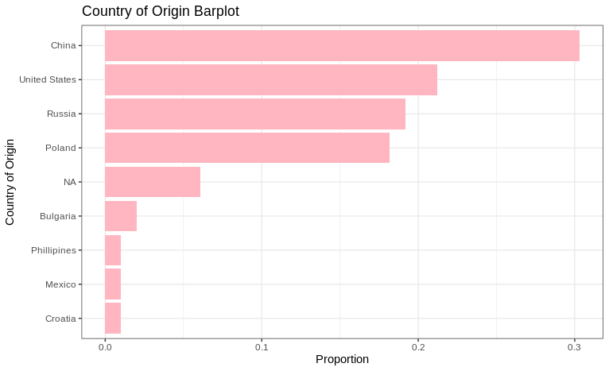

# Qualitative Variables

Qualitative variables can be thought of as categories: so variables like eye color, gender, and race. 
When assessing qualitative variables it is useful to consider proportions:

$$\frac{n_i}{N}$$

!!! example "Explanation of Terms"

    - $n_i$ number in category of interest
    - $N$ total number of observations

So let's calculate some proportions in R!

```R
library(tidyverse)
meta <- read.table("./data/gbm_cptac_2021/data_clinical_patient.txt",
                   header = T,
                   sep="\t")

country_sum <- meta %>%
  count(COUNTRY_OF_ORIGIN, sort = TRUE) %>% 
  mutate(proportion = n / sum(n)) %>%
  mutate(COUNTRY_OF_ORIGIN = replace_na(COUNTRY_OF_ORIGIN,"NA"))

country_sum
```

```
  COUNTRY_OF_ORIGIN  n proportion
1             China 30 0.30303030
2     United States 21 0.21212121
3            Russia 19 0.19191919
4            Poland 18 0.18181818
5              <NA>  6 0.06060606
6          Bulgaria  2 0.02020202
7           Croatia  1 0.01010101
8            Mexico  1 0.01010101
9       Phillipines  1 0.01010101
```

!!! note 
    You'll see that we do have an `NA` value here and that it's proportion in our variable is counted too! Since the `NA` value in R has special properties we ensure it is a **character** and not an NA value using the `replace_na()` function. 

Qualitative variables can be visualized using a bar plot:

```R
ggplot(country_sum, aes(x=proportion,y=reorder(COUNTRY_OF_ORIGIN,+proportion))) + 
  geom_bar(fill="lightpink",stat = "identity")+
  theme_bw()+
  labs(
    x="Proportion",
    y="Country of Origin",
    title="Country of Origin Barplot"
  )
```



!!! tip
    Here we ensure that we reorder our countries with the `reorder()` function as `ggplot2` will not order our data for us.

## References

- [BIOL202 Tutorials](https://ubco-biology.github.io/BIOL202/desc_cat_Var.html)
