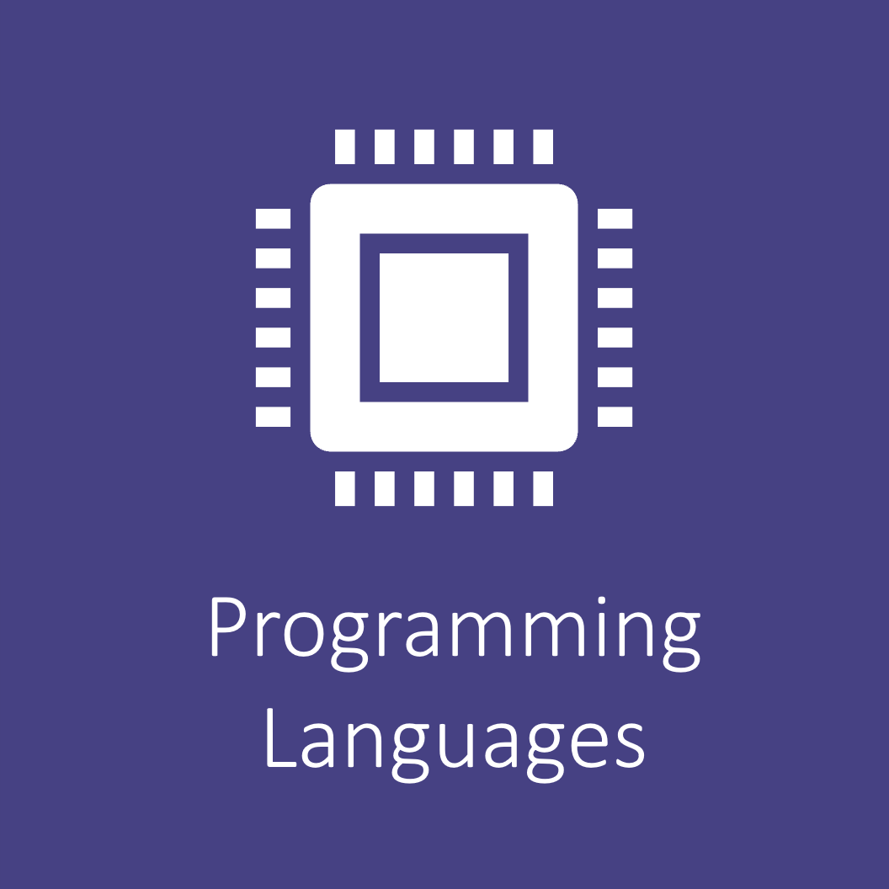

# JHU CompTox Lab
Welcome to the JHU CompTox Lab! Our goal is to make bio/cheminformatics concepts digestible and the application of techniques clear. We aim to cover topics in programming languages, biostatistics, machine learning, and 'omics level analysis. 

[{: style="height:150px;width:150px"}](programming_languages_tools/programming_languages_tools.md)
[{: style="height:150px;width:150px"}](biostatistics/biostatistics.md)
[{: style="height:150px;width:150px"}](machine_learning/machine_learning.md)
[{: style="height:150px;width:150px"}](omics/omics.md)

## Meet the Team

## About Us

