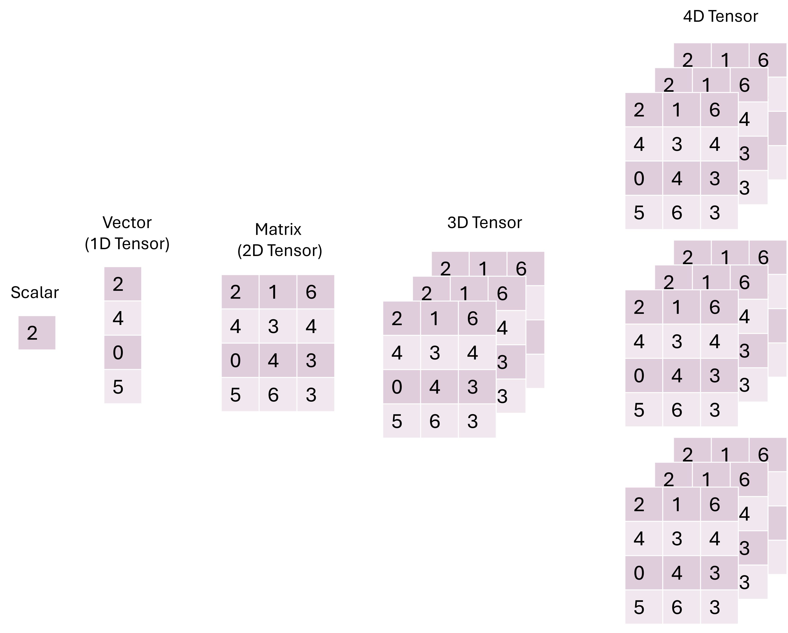

!!! example "Prerequisites"
    - [Deep Learning Setup](./00_setup.md) : Setup workspace and download python libraries

!!! abstract "Learning Objectives"
    1. [Tensors: Creation and Operations](tensors-creation-and-operations)
    2. [Tensor Manipulation: Reshaping, Stacking, and Indexing](tensor-manipulation-reshaping-stacking-and-indexing)
    3. [Tensor Aggregation and Statistics](tensor-aggregation-and-statistics)
    4. [Working with GPUs](working-with-gpus)
    5. [Randomness and Reproducibility](randomness-and-reproducibility)
    6. [Tensor and NumPy Integration](tensor-and-numpy-integration)

## Tensors: Creation and Operations

Machine learning is all about manipulating numbers and to do that we have different ways of storing those numbers, typically in structures called tensors. Tensors can be a single number (scalar), a list or vector of numbers (1D tensor), a matrix (2D tensor), a list of matrices (3D tensor), so on and so forth:

!!! info "What is a Tensor?"
    <figure markdown="span">
      { width="500" }
    </figure>

Now let's see how we make a tensor in PyTorch!

```{python}
scalar = torch.tensor(7)  # Scalar
vector = torch.tensor([1, 2, 3])  # Vector
matrix = torch.tensor([[1, 2], [3, 4]])  # Matrix
tensor = torch.tensor([[[1, 2, 3], [4, 5, 6], [7, 8, 9]]])  # 3D Tensor
```

Machine learning papers always include a lot of math jargon, but don't be afraid! Let's go through a few of the symbols for tensors! 

!!! example "Math Attack!"
    - Scalar: A single number $s \in \mathbb{R}$.
    - Vector: A 1D array or vector is shown as: $\mathbf{v} \in \mathbb{R}^n$.
    - Matrix: A 2D array or matrix with m rows and n columns is shown as: $\mathbf{M} \in \mathbb{R}^{m \times n}$.
    - 3D Tensor: a list of o matrices with m rows and n columns is shown as: $\mathbf{M} \in \mathbb{R}^{o \times m \times n}$.

Now in python these tensors are shown using different numbers of brackets:

!!! info "Tips and Tricks"
    - Dimensions as brackets:
    - `[]` → 1D (vector)
    - `[[]]` → 2D (matrix)
    - `[[[]]]` → 3D


## Basic Operations

Again, tensors are just numbers and we can perform basic operations on them, like addition, subtraction, multiplication and division. Let's go through how we would do that!

```{python}
tensor = torch.tensor([1, 2, 3])
print(tensor + 10)  # Addition
print(tensor * 10)  # Multiplication
```

!!! info "output"
    ```{python}
    tensor([11, 12, 13])
    tensor([10, 20, 30])
    ```

Now in math speak we represent 

!!! example "Math Attack!"
    - Element-wise addition: $\mathbf{A} + c$, where $c$ is added to each element in $\mathbf{A}$.
    - Element-wise multiplication: $\mathbf{A} \times c$, where $c$ multiplies each element of $\mathbf{A}$.

!!! info "Tips and Tricks"
    - Reassign to modify: Operations don’t change the tensor unless you reassign the result back to some variable.


## Matrix Multiplication

A lot of machine learning relies heavily on matrix operations and often times multiplying matrices together. When we multiple matrices we need to match the inner dimensions and then we end up with a matrix with the outer dimensions:

!!! success "This Works!"
    $A(4 \times 2) \cdot B(2 \times 3) \rightarrow C(4 \times 3)$
    This works because the inner dimensions are 2 and 2

!!! failure "This Doesn't Work!"
    $A(4 \times 3) \cdot B(2 \times 3) \rightarrow X$
    This does not work because the inner dimensions are 3 and 2. The are different!

Let's do this in PyTorch!

```{python}
# Define A as a 2x3 tensor
A = torch.tensor([[1, 2, 3], [4, 5, 6]])
# Define B as a 3x2 tensor
B = torch.tensor([[7, 8], [9, 10], [11, 12]])
# Perform matrix multiplication
result = torch.matmul(A, B)
print(result)
```

!!! info "output"
    ```{python}
    tensor([[ 58,  64],
            [139, 154]])
    ```

!!! tip "Tips and Tricks"
    - Instead of writing out `torch.matmul(A,B)` you can use the shorthand `A @ B` for the same result!

Now what would this look like in math speak?

!!! example "Math Attack!"
    - Matrix multiplication: For:
    $\mathbf{A} \in \mathbb{R}^{m \times n}$ 
    $\mathbf{B} \in \mathbb{R}^{n \times p}$
    the matrix product is:
    $\mathbf{C} = \mathbf{A} \cdot \mathbf{B}$ 
    and each value is calculated by
    $c_{ij} = \sum_{k=1}^{n} a_{ik} \cdot b_{kj}$

Now that's a lot, let's just look at a visualization of how you multiply matrices:
    
<video width="626" height="364" controls>
  <source src="img/mat_mult.mp4" type="mp4">
</video>

<video controls>
<source src="img/mat_mult.mp4" type="video/mp4">
</video>

<source src="../img/mat_mult.mp4" type="video/mp4">

<video controls>
<source src="../img/mat_mult.mp4" type="video/mp4">
</video>

## 2. Tensor Manipulation: Reshaping, Stacking, and Indexing
### Reshape and Squeeze
Change tensor shapes or remove/add dimensions of size 1.

```{python}
x = torch.arange(1, 10).reshape(3, 3)  # Reshape to 3x3
x_squeezed = x.squeeze()  # Remove dimensions of size 1
x_unsqueezed = x.unsqueeze(0)  # Add a dimension
```

!!! example "Math Attack!"
    - Reshape: Adjusts tensor dimensions while keeping the same number of elements, i.e., $m \times n = p \times q$.
    - Squeeze: Removes dimensions with size 1.
    
!!! info "Tips and Tricks"
    - Squeeze and unsqueeze: Squeeze removes "extra" dimensions, unsqueeze adds them back.

### Stacking Tensors
Stack multiple tensors along a new dimension.

```{python}
x_stacked = torch.stack([x, x], dim=0)
print(x_stacked)
```

!!! info "Tips and Tricks"
    - Stacking is like a sandwich: You’re adding a new layer (dimension) on top of existing tensors.

### Indexing
Select specific elements in tensors.

```{python}
x = torch.tensor([[1, 2, 3], [4, 5, 6]])
print(x[:, 1])  # Second column
print(x[0, 0])  # Element at (0, 0)
```

!!! info "Tips and Tricks"
    - Indexing is slicing: You can slice from any dimension of the tensor, similar to cutting bread slices.

## 3. Tensor Aggregation and Statistics
### Aggregation Functions
Use functions like min, max, mean, and sum to reduce tensors.

```{python}
x = torch.tensor([1, 2, 3, 4])
print(x.min(), x.max(), x.mean(), x.sum())
```

!!! example "Math Attack!"
    - Min: $\text{min}(x)$ returns the smallest element.
    - Max: $\text{max}(x)$ returns the largest element.
    - Mean: $\text{mean}(x) = \frac{1}{n} \sum_{i=1}^{n} x_i$, where $n$ is the number of elements.
    - Sum: $\text{sum}(x) = \sum_{i=1}^{n} x_i$, where $n$ is the number of elements.

### Positional Min/Max
Get the index of the minimum and maximum values.

```{python}
x = torch.tensor([10, 20, 30])
print(x.argmax(), x.argmin())  # Index of max and min
```

## 4. Working with GPUs
### Check GPU Availability
Check if a GPU is available for faster computation.

```{python}
torch.cuda.is_available()  # True if GPU is available
```

### Moving Tensors to GPU
Transfer tensors to the GPU for faster calculations.

```{python}
device = 'cuda' if torch.cuda.is_available() else 'cpu'
tensor = torch.tensor([1, 2, 3]).to(device)
print(tensor)
```

### Moving Back to CPU
Move tensors back to the CPU for further processing.

```{python}
tensor_cpu = tensor.to('cpu')
```
    
## 5. Randomness and Reproducibility
### Set Random Seed
Ensure reproducible results by setting a random seed.

```{python}
torch.manual_seed(42)
random_tensor = torch.rand(3, 4)
print(random_tensor)
```

## 6. Tensor and NumPy Integration
Convert Between NumPy and PyTorch

```{python}
# NumPy to PyTorch
import numpy as np
np_array = np.array([1, 2, 3])
tensor = torch.from_numpy(np_array)
print(tensor)
```

```{python}
# PyTorch to NumPy
numpy_array = tensor.numpy()
print(numpy_array)
```

