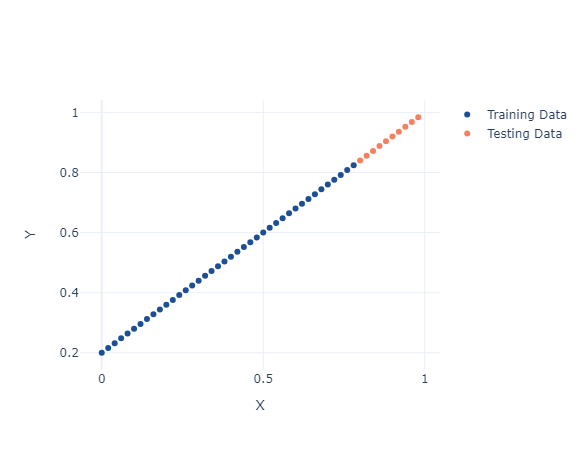
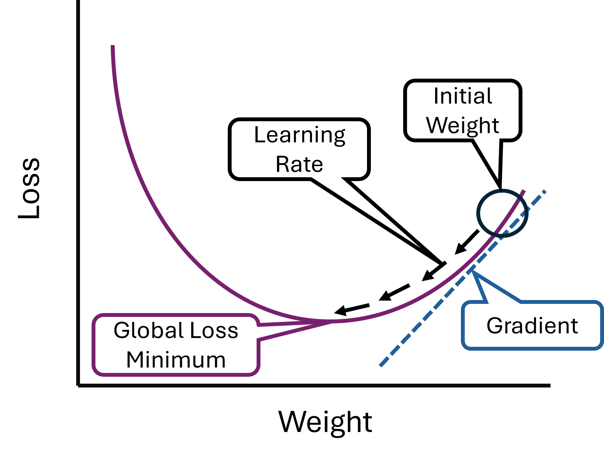
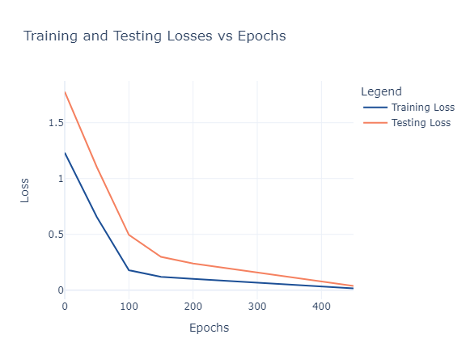
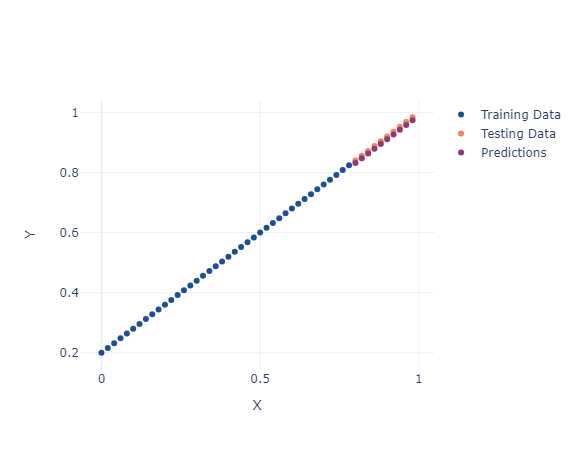

!!! example "Prerequisites"
    - [Deep Learning Setup](./00_setup.md) : Setup workspace and download python libraries

!!! abstract "Learning Objectives"
    1. [Tensors: Creation and Operations](#1-tensors-creation-and-operations)
    2. [Tensor Manipulation: Reshaping, Stacking, and Indexing](#2-tensor-manipulation-reshaping-stacking-and-indexing)
    3. [Tensor Aggregation and Statistics](#3-tensor-aggregation-and-statistics)
    4. [Working with GPUs](#4-working-with-gpus)
    5. [Randomness and Reproducibility](#5-randomness-and-reproducibility)
    6. [Tensor and NumPy Integration](#6-tensor-and-numpy-integration)

## 1. Building a Model

We are going to start with a simple example of a line where we know the slope (i.e. the weight), the bias (i.e. the y intercept) and fill it with values from 0 to 1 that increase by 0.02 each value.

```{python}
import torch
import plotly.graph_objects as go

# Create a simple linear dataset
weight = 0.8
bias = 0.2
X = torch.arange(0, 1, 0.02).unsqueeze(1)
y = weight * X + bias
```

### 2. Training and Test Data

When we work with models, we often want to **train** our model to predict some result and then **test** it to see if it is working. Usually we allocate the majority of the data (in this case 80%) to the training data, and a minority of the data (20%) as our testing data.

```{python}
# Split data into training and test sets (80/20 split)
train_split = int(0.8 * len(X))
X_train, y_train = X[:train_split], y[:train_split]
X_test, y_test = X[train_split:], y[train_split:]
```

When working with data, it is critical that we visually inspect it! You would be suprised how many mistakes or eureka moments can happen just by making a graph. Here we will use plotly to plot our training data, testing data and any predictions we might make.

```{python}
# Plot data using Plotly
def plot_predictions(train_data, train_labels, test_data, test_labels, predictions=None):
    fig = go.Figure()
    
    # Plot training data
    fig.add_trace(go.Scatter(x=train_data.squeeze(), y=train_labels.squeeze(), mode='markers', name='Training Data', marker=dict(color='#1c4f96')))
    
    # Plot testing data
    fig.add_trace(go.Scatter(x=test_data.squeeze(), y=test_labels.squeeze(), mode='markers', name='Testing Data', marker=dict(color='#f58160')))
    
    # Plot predictions if available
    if predictions is not None:
        fig.add_trace(go.Scatter(x=test_data.squeeze(), y=predictions.squeeze(), mode='markers', name='Predictions', marker=dict(color='#8f3974')))
    
    # Update layout
    fig.update_layout(
        xaxis_title='X',
        yaxis_title='Y',
        template='plotly_white'
    )
    # Show the plot
    fig.show()

plot_predictions(X_train, y_train, X_test, y_test)
```

<figure markdown="span">
  { width="500" }
  <figcaption>Features v. Outcome for Testing and Training Data</figcaption>
</figure>

!!! info "Features v. Outcome for Testing and Training Data"
    <figure markdown="span">
      { width="500" }
      <figcaption>Image caption</figcaption>
    </figure>
    

To create a model we will start by defining a few things. We are goint to make a class, `LrModel`. A class is essentially a map for creating objects and has methods and attributes:
- Attributes are variables that belong to the class
- Methods are functions inside that class that help perform some function

If we use this class on some data that is an instance of the class. Now here we define one layer, `linear` with one input and one output. Then we define a method, `forward` where the output of the single layer is returned. This is essentially describing how inputs move through the model. You'll note that after we initiate the model, we print it's initial random parameters with `model.state_dict`.

```{python}
import torch.nn as nn

# Define a linear regression model
class LrModel(nn.Module): # ensure that nn.Module is inherited
    def __init__(self):
        super().__init__()
        self.linear = nn.Linear(in_features=1, out_features=1) # define one layer, with one input and one output
    
    def forward(self, x): # create a method, that will return the output of the one layer, this describes how inputs move through the model 
        return self.linear(x)

# Initiate the model
model = LrModel() # initiate the model and create an instance!

# Check initial parameters
print(model.state_dict()) 
```

## 3. Training the Model

Ok so we have the shell of a model, now we need to train it on our data so that it can make predictions! To do this we are going to introduce a couple concepts:

- **Loss Function**: measures how far off the predictions are from the real data points. Here we are using the L1 loss AKA Mean Absolute Error (MAE).
- **Optimizer**: The optimizer will update the parameters of the model in order to minimize the loss. Here we are using stochastic gradient descent with a learning rate, which controls how big the updates are, of 0.01
- **Epoch**: An epoch is just how many times the model is reevaluated, and parameters are updated.
- **Backpropagation**: This involves calculating the loss from your input and then using this information you *backpropagate* that information into the model to update the weights. Essentially, allowing the model to learn and improve it's predictions.
- **Gradient Descent**: So we are left with a question - what weights, lead to the smallest loss value? To get to this minimum we need to use gradient descent, where we calculate the derivative of the loss function with respect to the model weights to get to some minimum loss value that has our desired model weight!

!!! info "Gradient Descent" 
    {width="500", align=center}

    Adapted from the [carpentries tutorial on deep learning](https://carpentries-incubator.github.io/deep-learning-intro/3-monitor-the-model.html)
    

```{python}
# Loss function and optimizer
loss_fn = nn.L1Loss()
optimizer = torch.optim.SGD(model.parameters(), lr=0.01)

# Training loop
epochs = 500
train_loss_vals = []
test_loss_vals = []
epoch_vals = []

for epoch in range(epochs):
    model.train()  # Set model to training mode
    y_pred = model(X_train)  # Forward pass
    loss = loss_fn(y_pred, y_train)  # Calculate loss
    
    optimizer.zero_grad()  # Zero gradients
    loss.backward()  # Backpropagation
    optimizer.step()  # Update parameters
    
    # Evaluate every 50 epochs
    if epoch % 50 == 0:
        model.eval() # set the model in evaluation mode
        with torch.inference_mode(): # get into inference mode
            test_pred = model(X_test)
            test_loss = loss_fn(test_pred, y_test)
            train_loss_vals.append(loss.detach().numpy())
            test_loss_vals.append(test_loss.detach().numpy())
            epoch_vals.append(epoch)
            print(f"Epoch {epoch}: Train Loss = {loss.item()}, Test Loss = {test_loss.item()}")
```

We should point out how we are using torch's inference mode, `with torch.inference_mode()`, to make predictions. This will stop gradient calculations in order to evaluate our model in a memory efficient way. Now let's take a look at the relationship between the number of epochs and the losses for both the test and training data. 

```{python}
# define a function for plotting losses v. epochs
def plot_epoch_losses(epochs, train_losses, test_losses):
    fig = go.Figure()
    
    # Plot training losses
    fig.add_trace(go.Scatter(x=epochs, y=train_losses, mode='lines', name='Training Loss', marker=dict(color='#1c4f96')))
    
    # Plot testing losses
    fig.add_trace(go.Scatter(x=epochs, y=test_losses, mode='lines', name='Testing Loss', marker=dict(color='#f58160')))
    
    # Update layout
    fig.update_layout(
        title='Training and Testing Losses vs Epochs',
        xaxis_title='Epochs',
        yaxis_title='Loss',
        legend_title='Legend',
        template='plotly_white'
    )
    
    # Show the plot
    fig.show()

plot_epoch_losses(epoch_vals, train_loss_vals, test_loss_vals)
```

!!! info "Epochs v. Loss"
    {width="500", align=center}

Here we see that the testing error is higher than the training data for the first few hundred epochs until around epoch 300. Now that we have trained our model and see that the loss is quite low, let's compare these predicted values back to the original values.

```{python}
# Make predictions after training
model.eval()
with torch.inference_mode():
    y_preds = model(X_test)

# Plot predictions using Plotly
plot_predictions(X_train, y_train, X_test, y_test, y_preds)
```
!!! info "True and Predicted Data"
    {width="500", align=center}


They look great! The predicted values appear to track both tested and traing values well!


## 4. Saving Models

To save your model, you can use `torch.save` and save the current state of the model with `model.state_dict` and then designate where to put your model with a file name (here we call it `lr_model.pth`).

```{python}
# Save model
torch.save(model.state_dict(), "lr_model.pth")
```

Now to load this model we can use `torch.load` and then the path to our model file name, `lr_model.pth`.

```{python}
# Load model
loaded_model = LrModel()
loaded_model.load_state_dict(torch.load("lr_model.pth"))
```
