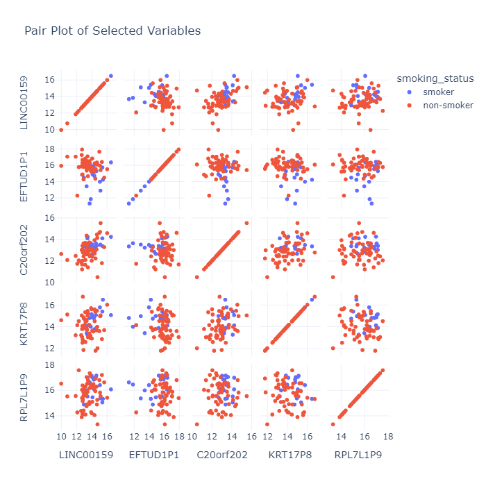
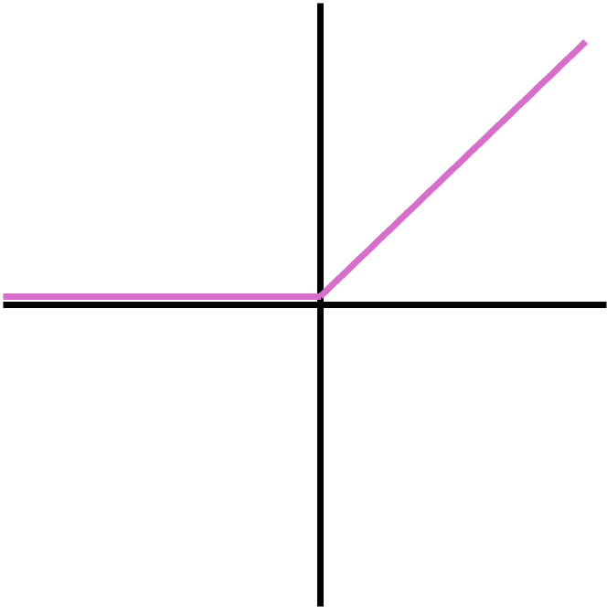
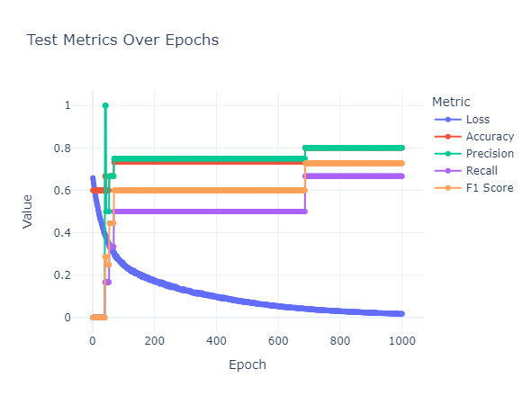

## Binary Classifiers

In the previous section, we predicted numeric values using in a regression model. However, deep learning is not limited to predicting numbers but classes as well. So how do we do this? 

## Data Preparation and Exploration

We are going to start by scoping a problem for our model to solve. In this case we are going to use glioblastoma gene expression data, where we will use a gene's expression (level of RNA that gene has made) to predict a phenotype. To start we will try to predict smoking status. First, let's load the data and take a peak!

```{python}
import pandas as pd
import numpy as np
import plotly.express as px
from sklearn.model_selection import train_test_split
from sklearn.preprocessing import StandardScaler
import torch
from sklearn.metrics import accuracy_score, precision_score, recall_score, f1_score
from torch.utils.data import DataLoader, TensorDataset
import torch.nn as nn
import torch.optim as optim

gbm = pd.read_csv("../data/gbm_data.csv",on_bad_lines='skip')
gbm.shape
```

!!! info "output"
    ```{python}
    (87, 133)
    ```

Great! We can see that this data frame contains 87 rows and 133 columns. Let's take a peak at the column that would contain smoking status:

```{python}
gbm.loc[:,"SMOKING_HISTORY"]
```

!!! info "output"
    ```{python}
    0          Current reformed smoker within past 15 years
    1          Current reformed smoker within past 15 years
    2                                                   NaN
                                ...                        
    86    Lifelong non-smoker: Less than 100 cigarettes ...
    Name: SMOKING_HISTORY, Length: 87, dtype: object
    ```

    
This doesn't look particularly clean, so we will just have to make a new column with the smoking status. We will do this by saying that if we see "non-smoker" in the text, then we classify the sample as coming from a non-smoker. But before this we should remove the NA rows, given we don't have any smoking information on them!

```{py}
gbm = gbm[gbm['SMOKING_HISTORY'].notna()]
gbm['smoking_status'] = np.where(gbm['SMOKING_HISTORY'].str.contains('non-smoker'), 'non-smoker', 'smoker')
gbm.loc[:,"smoking_status"]
```

!!! info "output"
    ```{python}
    0         smoker
    1         smoker
    3         smoker
             ...    
    84        smoker
    85    non-smoker
    86    non-smoker
    Name: smoking_status, Length: 75, dtype: object
    ```

Now before going forward, it is critical to take a look at our data. Are there any obvious patterns right off the bat? Let's visualize the first few variables using a pairplot:


```{py}
# Create a pair plot
fig = px.scatter_matrix(gbm, 
            dimensions=['LINC00159','EFTUD1P1','C20orf202','KRT17P8','RPL7L1P9'],
            color="smoking_status",
            title="Pair Plot of Selected Variables")
fig.update_layout(
    height=700,
    width=700,
    template='plotly_white'
          )
fig.show()
```

!!! info "Pairplot of Selected Features"
    <figure markdown="span">
      { width="350" }
    </figure>


We can see that a few of our variables can sort of startify smokers and non-smokers. Now that we have the smoking status variable in our data frame and we have a few features to use, we can start getting our data ready for our model! However, to give this to a machine learning model we need to make this into a number (Here we will do 0 and 1).


```{py}
gbm_filt = gbm.loc[:,['LINC00159','EFTUD1P1','C20orf202','KRT17P8','RPL7L1P9','smoking_status']]
gbm_filt['smoking_status'] = gbm_filt['smoking_status'].astype('category').cat.codes
gbm_filt['smoking_status']
```

!!! info "output"
    ```{python}
    0     1
    1     1
         ..
    85    0
    86    0
    Name: smoking_status, Length: 75, dtype: int8
    ```

Now let's split our data into our features (things used to predict) and outcome (the thing to be predicted):

```{py}
# Split the data into features and outcome variable
X = gbm_filt.drop('smoking_status', axis=1).values
y = gbm_filt['smoking_status'].values
```

When dealing with variables we often need to make sure they are on the same scale. That way, one variable doesn't have way more pull than another just because one is an order of magnitude larger.

```{py}
# Normalize the features
scaler = StandardScaler()
X = scaler.fit_transform(X)
```

Now we are going to split our data into training and test sets. Then we will convert our data into tensors so Pytorch can use the data: 

```{py}
# Split the data into training and testing sets
X_train, X_test, y_train, y_test = train_test_split(X, y, test_size=0.2, random_state=81)

# Convert to PyTorch tensors
X_train_tensor = torch.tensor(X_train, dtype=torch.float32)
y_train_tensor = torch.tensor(y_train, dtype=torch.long)
X_test_tensor = torch.tensor(X_test, dtype=torch.float32)
y_test_tensor = torch.tensor(y_test, dtype=torch.long)
```

We will now convert our training and test data into a `TensorDataset` object, then we manage that object using `DataLoader`, which acts to process the data in batches for parallel processing: 

```{py}
# Create DataLoader
train_dataset = TensorDataset(X_train_tensor, y_train_tensor)
test_dataset = TensorDataset(X_test_tensor, y_test_tensor)
train_loader = DataLoader(train_dataset, batch_size=32, shuffle=True)
test_loader = DataLoader(test_dataset, batch_size=32, shuffle=False)
```

With our data prepared, we can make our model! Let's create a model that takes in our 5 genes, creates two hidden layers with 64 nodes, and returns two output layers or the number of classes:

```{py}
class SSModel(nn.Module):
    '''
    Create a model to predict smoking status
    which is one column 0 for non-smoker, 1 for smoker
    '''
    def __init__(self, input_size,num_nodes=64):
        super().__init__()
        self.fc1 = nn.Linear(input_size, num_nodes) # take input_size number of features and make a hidden layer with 64 nodes
        self.relu = nn.ReLU() # use ReLU as the activation function
        self.fc2 = nn.Linear(num_nodes, 1) # we are predicting values in one column
    
    def forward(self, x):
        out = self.fc1(x)
        out = self.relu(out)
        out = self.fc2(out)
        return out

# Initialize the model, and specify the number of 
# features going in and how many going out
input_size = X_train.shape[1]
model = SSModel(input_size)
```

You'll notice that we have a new element in our model, `nn.ReLU`. ReLU is a popular activation function that is often used to determine, the output of a node, if the value is negative the output is 0 and if the value is positive the output is 1. The power of an activation function is that it can introduce non-linearity into the model. This allows for the learning of complex patterns - patterns that a linear model might miss. 

!!! info "ReLU Activation Function"
    <figure markdown="span">
      { width="200" }
    </figure>

$f(x) = max(0,x)$

Now let's specify our optimizer (to get to our optimum weights) and our loss function (to specify how far away our model is from the truth):


```{py}
# Specify the loss function and optimizer
criterion = nn.BCEWithLogitsLoss()
optimizer = optim.Adam(model.parameters(), lr=0.001)
```

With all the pieces in place, we can train and evaluate our model!

```{py}
# Training loop
num_epochs = 1000
epoch_vals = []
loss_vals = []
acc_vals = []
pre_vals = []
recall_vals = []
f1_vals = []

for epoch in range(num_epochs):
    # Training the model
    model.train()  # set model in training mode
    running_loss = 0.0  # to accumulate loss for the epoch

    for X_batch, y_batch in train_loader:
        #X_batch, y_batch = X_batch.to(device), y_batch.to(device)  # move to device

        # Forward pass
        outputs = model(X_batch)  # run model on the batch
        y_long = y_batch.view(-1, 1).float()  # reshape y for compatibility
        loss = criterion(outputs, y_long)  # calculate loss

        # Backward pass and optimization
        optimizer.zero_grad()  # clear gradients
        loss.backward()  # backpropagation
        optimizer.step()  # gradient descent

        running_loss += loss.item()  # accumulate batch loss

    # Append the average loss for the epoch
    loss_vals.append(running_loss / len(train_loader))

    # Evaluation
    model.eval()  # set model in evaluation mode
    with torch.inference_mode():
        all_preds = []  # list for predicted labels
        all_labels = []  # list for true labels

        # Model predictions on test data
        for X_batch, y_batch in test_loader:
            #X_batch, y_batch = X_batch.to(device), y_batch.to(device)  # move to device
            outputs = model(X_batch)  # get model outputs
            probabilities = torch.sigmoid(outputs)  # get probabilities from logits
            predicted = (probabilities > 0.5).float()  # convert probabilities to labels

            all_preds.extend(predicted.cpu().numpy())  # append predictions
            all_labels.extend(y_batch.cpu().numpy())  # append true labels

        # Calculate metrics
        accuracy = accuracy_score(all_labels, all_preds)
        precision = precision_score(all_labels, all_preds, average='binary', zero_division=0)
        recall = recall_score(all_labels, all_preds, average='binary')
        f1 = f1_score(all_labels, all_preds, average='binary')

        # Append metrics to lists
        epoch_vals.append(epoch)
        acc_vals.append(accuracy)
        pre_vals.append(precision)
        recall_vals.append(recall)
        f1_vals.append(f1)
```

```{py}
import plotly.graph_objects as go

# Create a figure
fig = go.Figure()

# Add traces for each metric
# add in loss 
fig.add_trace(go.Scatter(
    x=list(range(1, len(epoch_vals) + 1)),
      y=loss_vals,
        mode='lines+markers',
          name='Loss'))
# add in accuracy
fig.add_trace(go.Scatter(
    x=list(range(1, len(epoch_vals) + 1)),
      y=acc_vals,
        mode='lines+markers', 
        name='Accuracy'))
# add in precision
fig.add_trace(go.Scatter(
    x=list(range(1, len(epoch_vals) + 1)),
      y=pre_vals,
        mode='lines+markers', 
        name='Precision'))
# add in recall
fig.add_trace(go.Scatter(
    x=list(range(1, len(epoch_vals) + 1)), 
    y=recall_vals, 
    mode='lines+markers', 
    name='Recall'))
# add in F1 score
fig.add_trace(go.Scatter(
    x=list(range(1, len(epoch_vals) + 1)),
      y=f1_vals, 
      mode='lines+markers', 
      name='F1 Score'))

# Update layout
fig.update_layout(
    title='Training Metrics Over Epochs',
    xaxis_title='Epoch',
    yaxis_title='Value',
    legend_title='Metric',
    template='plotly_white'
)

# Show the plot
fig.show()
```

!!! info "Classifier Performance Metrics"
    <figure markdown="span">
      { width="200" }
    </figure>

    
