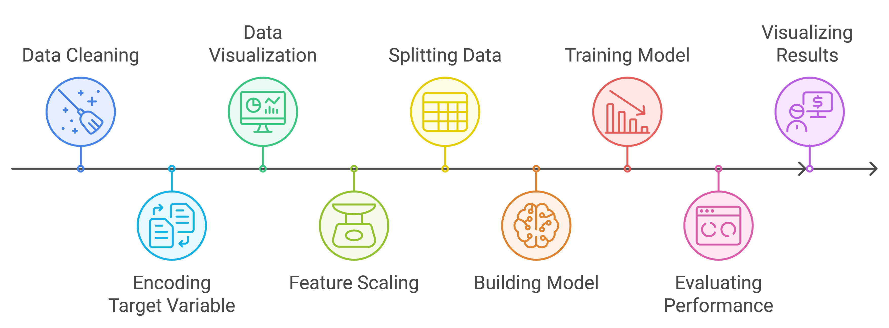
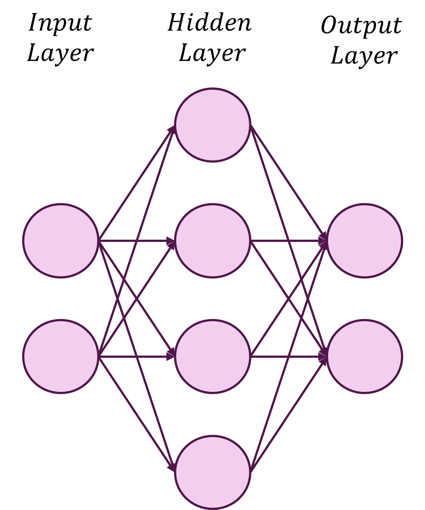
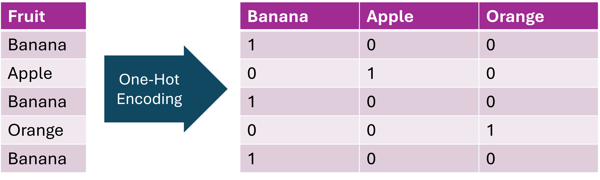

!!! example "Prerequisites"
    - [Deep Learning Setup](./00_setup.md) : Setup workspace and download python libraries

**Learning Objectives**

1. [Classifiers](#classifiers)
2. [Data Preparation and Exploration](#data-preparation-and-exploration)
3. [Build the Model](#build-the-model)
4. [Train and Evaluate the Model](#train-and-evaluate-the-model)

!!! info "Overview of Classification"
    <figure markdown="span">
      { width="600" }
      <figcaption>Generated with [Napkin](https://app.napkin.ai/)</figcaption>
    </figure>
    
## Classifiers

In the previous section, we predicted numeric values using in a regression model. However, deep learning is not limited to predicting numbers but classes as well. So how do we do this? 

## Data Preparation and Exploration

We are going to start by scoping a problem for our model to solve. In this case we are going to use glioblastoma gene expression data, where we will use a gene's expression (level of RNA that gene has made) to predict a phenotype. To start we will try to predict smoking status. First, let's load the data and take a peak!

```py
import pandas as pd
import numpy as np
import plotly.express as px
from sklearn.model_selection import train_test_split
from sklearn.preprocessing import StandardScaler
import torch
from sklearn.metrics import accuracy_score, precision_score, recall_score, f1_score
from torch.utils.data import DataLoader, TensorDataset
import torch.nn as nn
import torch.optim as optim

gbm = pd.read_csv("../data/gbm_data.csv",on_bad_lines='skip')
gbm.shape
```

!!! info "output"
    ```py
    (87, 133)
    ```

Great! We can see that this data frame contains 87 rows and 133 columns. Let's take a peak at the column that would contain smoking status:

```py
gbm.loc[:,"SMOKING_HISTORY"]
```

!!! info "output"
    ```py
    0          Current reformed smoker within past 15 years
    1          Current reformed smoker within past 15 years
    2                                                   NaN
                                ...                        
    86    Lifelong non-smoker: Less than 100 cigarettes ...
    Name: SMOKING_HISTORY, Length: 87, dtype: object
    ```

    
This doesn't look particularly clean, so we will just have to make a new column with the smoking status. We will do this by saying that if we see "non-smoker" in the text, then we classify the sample as coming from a non-smoker. But before this we should remove the NA rows, given we don't have any smoking information on them!

```py
gbm = gbm[gbm['SMOKING_HISTORY'].notna()]
gbm['smoking_status'] = np.where(gbm['SMOKING_HISTORY'].str.contains('non-smoker'), 'non-smoker', 'smoker')
gbm.loc[:,"smoking_status"]
```

!!! info "output"
    ```py
    0         smoker
    1         smoker
    3         smoker
             ...    
    84        smoker
    85    non-smoker
    86    non-smoker
    Name: smoking_status, Length: 75, dtype: object
    ```

Now before going forward, it is critical to take a look at our data. Are there any obvious patterns right off the bat? Let's visualize the first few variables using a pairplot:


```py
# Create a pair plot
fig = px.scatter_matrix(gbm, 
            dimensions=['LINC00159','EFTUD1P1','C20orf202','KRT17P8','RPL7L1P9'],
            color="smoking_status",
            title="Pair Plot of Selected Variables")
fig.update_layout(
    height=700,
    width=700,
    template='plotly_white'
          )
fig.show()
```

!!! info "Pairplot of Selected Features"
    <figure markdown="span">
      { width="600" }
    </figure>


We can see that a few of our variables can sort of startify smokers and non-smokers. Now that we have the smoking status variable in our data frame and we have a few features to use, we can start getting our data ready for our model! However, to give this to a machine learning model we need to make this into a number (Here we will do 0 and 1).


```py
gbm_filt = gbm.loc[:,['LINC00159','EFTUD1P1','C20orf202','KRT17P8','RPL7L1P9','smoking_status']]
gbm_filt['smoking_status'] = gbm_filt['smoking_status'].astype('category').cat.codes
gbm_filt['smoking_status']
```

!!! info "output"
    ```py
    0     1
    1     1
         ..
    85    0
    86    0
    Name: smoking_status, Length: 75, dtype: int8
    ```

Now let's split our data into our features (things used to predict) and outcome (the thing to be predicted):

```py
# Split the data into features and outcome variable
X = gbm_filt.drop('smoking_status', axis=1).values
y = gbm_filt['smoking_status'].values
```

When dealing with variables we often need to make sure they are on the same scale. That way, one variable doesn't have way more pull than another just because one is an order of magnitude larger.

```py
# Normalize the features
scaler = StandardScaler()
X = scaler.fit_transform(X)
```

Now we are going to split our data into training and test sets. Then we will convert our data into tensors so Pytorch can use the data: 

```py
# Split the data into training and testing sets
X_train, X_test, y_train, y_test = train_test_split(X, y, test_size=0.2, random_state=81)

# Convert to PyTorch tensors
X_train_tensor = torch.tensor(X_train, dtype=torch.float32)
y_train_tensor = torch.tensor(y_train, dtype=torch.long)
X_test_tensor = torch.tensor(X_test, dtype=torch.float32)
y_test_tensor = torch.tensor(y_test, dtype=torch.long)
```

We will now convert our training and test data into a `TensorDataset` object, then we manage that object using `DataLoader`, which acts to process the data in batches for parallel processing: 

```py
# Create DataLoader
train_dataset = TensorDataset(X_train_tensor, y_train_tensor)
test_dataset = TensorDataset(X_test_tensor, y_test_tensor)
train_loader = DataLoader(train_dataset, batch_size=32, shuffle=True)
test_loader = DataLoader(test_dataset, batch_size=32, shuffle=False)
```

## Build the Model 

With our data prepared, we can make our model! But we have decisions to make. Our model is going to be a little more complex than our previous simple linear model. We are going to make what is called a **multilayer perceptron**. It sounds complicated but all it is is a neural network where all nodes in one layer are connected to all nodes in the next layer:

!!! info "Multilayer Perceptron Architecture"
    <figure markdown="span">
      { width="400" }
      <figcaption></figcaption>
    </figure>

This is great starting point with neural networks as we are not doing anything funky with connecting nodes. Each node is just connected to all nodes in the next layer. But we still need to make decisions about our loss function, the optimizer and now our **activation function** given we are connecting multiple layers.

### Loss Functions

As a review loss functions tell us how far off our predicted value is to our real value and there are a few different ways to define loss:

| **Loss Function**                       | **Task**                        | **Equation**                                                                                              | **Description**                                                                                 | **PyTorch Function**                  |
|-----------------------------------------|---------------------------------|-----------------------------------------------------------------------------------------------------------|-------------------------------------------------------------------------------------------------|----------------------------------------|
| **Binary Cross-Entropy Loss**           | Binary classification           | $\text{BCE} = -\frac{1}{N} \sum_{i=1}^{N} \left[ y_i \log(\hat{y}_i) + (1 - y_i) \log(1 - \hat{y}_i) \right]$ | - $y$: true label <br> - $\hat{y}$: predicted probability <br> - $N$: number of samples | `torch.nn.BCELoss` or `torch.nn.BCEWithLogitsLoss` |
| **Cross-Entropy Loss (Multi-Class)**    | Multi-class classification      | $\text{CE} = -\sum_{i=1}^{C} y_i \log(\hat{y}_i)$                                          | - $C$: number of classes <br> - $y_i$: one-hot encoded true label <br> - $\hat{y}_i$: predicted probability for class $i$ | `torch.nn.CrossEntropyLoss`           |
| **Mean Absolute Error (MAE) / L1 Loss** | Regression                      | $\text{MAE} = \frac{1}{N} \sum_{i=1}^{N} \|y_i - \hat{y}_i\|$                               | - $y$: true value <br> - $\hat{y}$: predicted value | `torch.nn.L1Loss`                     |
| **Mean Squared Error (MSE) / L2 Loss**  | Regression                      | $\text{MSE} = \frac{1}{N} \sum_{i=1}^{N} (y_i - \hat{y}_i)^2$                              | - $y$: true value <br> - $\hat{y}$: predicted value | `torch.nn.MSELoss`                    |

Now you may notice that when using the cross-entropy loss, labels are one-hot encoded. What does that even mean? Well all this means is that in a column with two or more unique values, unique values are made into new columns, and if the original column had that value, you put a 1, if not, you put a 0. Take a look at this visualization:

!!! info "One-Hot Encoding"
    <figure markdown="span">
      { width="400" }
      <figcaption></figcaption>
    </figure>

Now how about optimizers?

### Optimizers

Optimizers tweak our model so that we _optimize_ our model parameters to minimize the loss:

| **Optimizer**              | **Task**                        | **Equation** / **Update Rule**                                                                                       | **Description**                                                                                 | **PyTorch Function**                  |
|----------------------------|---------------------------------|-----------------------------------------------------------------------------------------------------------------------|-------------------------------------------------------------------------------------------------|----------------------------------------|
| **Stochastic Gradient Descent (SGD)** | General optimization          | $\theta_{t+1} = \theta_t - \eta \nabla_\theta J(\theta_t)$                                                            | $\theta_t$: parameters at step $t$ <br> $\eta$: learning rate <br> $\nabla_\theta J(\theta_t)$: gradient of the loss function <br> Basic optimization algorithm | `torch.optim.SGD`                     |
| **Adam**                   | Adaptive momentum and learning rate | $m_t = \beta_1 m_{t-1} + (1 - \beta_1) \nabla_\theta J(\theta_t)$ <br> $v_t = \beta_2 v_{t-1} + (1 - \beta_2) (\nabla_\theta J(\theta_t))^2$ <br> $\hat{m}\_t = \frac{m_t}{1 - \beta_1^t}$ <br> $\hat{v}\_t = \frac{v_t}{1 - \beta_2^t}$ <br> $\theta_{t+1} = \theta_t - \frac{\eta \hat{m}_t}{\sqrt{\hat{v}_t + \epsilon}}$ | $\theta_t$: parameters at step $t$ <br> $m_t$: first moment (mean) estimate <br> $v_t$: second moment (variance) estimate <br> $\hat{m}_t$, $\hat{v}_t$: bias-corrected moment estimates <br> $\eta$: learning rate <br> $\beta_1$, $\beta_2$: exponential decay rates <br> $\epsilon$: small constant for numerical stability | `torch.optim.Adam`                    |

Eww that is a lot of math feel free to click the example below to see how a simple gradient descent is calculated using SGD and an MSE loss function:

??? info "Gradient Descent Example"
    
    When we train our model, we need to know how changing the parameters—like weights and biases—affects the output. This is where partial derivatives come in.     Think of them as tiny nudges in different directions that tell us how much each part of our function changes when we adjust one variable while keeping the     others fixed.
    We’re going to look at how to find these nudges step by step, using a simple linear regression model:
    
    $J(w, b) = \frac{1}{2} (y - \hat{y})^2$
    
    where $\hat{y}$ is our prediction:
    
    $\hat{y} = w \cdot x + b$
    
    **Step 1: Partial Derivative with Respect to $w$**
    
    First up, we need to figure out how changing $w$ affects our loss $J$. Mathematically, that looks like this:
    
    $\frac{\partial J}{\partial w} = \frac{\partial}{\partial w} \left[ \frac{1}{2} (y - \hat{y})^2 \right]$
    
    Let’s plug in our prediction:
    
    $\frac{\partial J}{\partial w} = \frac{\partial}{\partial w} \left[ \frac{1}{2} (y - (w \cdot x + b))^2 \right]$
    
    We apply the chain rule here:
    
    - The outer part, $(y - \hat{y})^2$, becomes $(y - \hat{y}) \cdot (-1)$ when we differentiate.
    - The inner part, $\hat{y}$, with respect to $w$ is just $x$.
    
    Putting it together:
    
    $\frac{\partial J}{\partial w} = -(y - \hat{y}) \cdot x$
    
    **Plug in the Values:**
    
    With our data point $(x, y) = (2, 3)$ and initial parameters $w_0 = 1.5$, $b_0 = 0.1$:
    
    $\hat{y} = 1.5 \cdot 2 + 0.1 = 3.1$
    
    Gradient with respect to $w$:
    
    $\frac{\partial J}{\partial w} = -(3 - 3.1) \cdot 2 = 0.2$
    
    **Step 2: Partial Derivative with Respect to $b$**
    
    Now let’s see what happens when we change $b$:
    
    $\frac{\partial J}{\partial b} = -(y - \hat{y})$
    
    **Plug in the values:**
    
    $\frac{\partial J}{\partial b} = -(3 - 3.1) = 0.1$
    
    **Step 3: Combine into a Gradient**
    
    We store these partial derivatives in a gradient:
    
    $\nabla J(w, b) = \begin{bmatrix} \frac{\partial J}{\partial w} \\ \frac{\partial J}{\partial b} \end{bmatrix} = \begin{bmatrix} 0.2 \\ 0.1 \end{bmatrix}$
    
    **Step 4: Update the Parameters**
    
    Finally, we use the gradient descent update rule (with $\eta$ being our learning rate - here it is 0.01):
    
    $\theta_{t+1} = \theta_t - \eta \nabla_\theta J(\theta_t)$
    
    For $w$ and $b$, this means:
    
    - **Update $w$**:
    
    $w_{1} = 1.5 - 0.01 \cdot 0.2 = 1.498$
    
    - **Update $b$**:
    
    $b_{1} = 0.1 - 0.01 \cdot 0.1 = 0.099$
    
    **The Result**
    
    After one step, our new parameters are:
    
    - **Updated $w$**: 1.498
    - **Updated $b$**: 0.099
    
    And that update to our model parameter is a step towards improving our model!

### Activation Functions 

Once we have updated our model parameters to optimize our loss, we need to decide what to do with the output. Depending on our goal we will use different activation functions:


| **Activation Function** | **Equation**                                  | **Description** | **Typical Use** | **PyTorch Function** |
|--------------------------|-----------------------------------------------|------------------|------------------|-----------------------|
| **ReLU (Rectified Linear Unit)** | $\text{ReLU}(x) = \max(0, x)$          | - Outputs the input directly if positive, otherwise outputs zero <br> - Helps mitigate the vanishing gradient problem | Hidden layers of deep neural networks | `torch.nn.ReLU()` or `torch.relu()` |
| **Sigmoid**              | $\sigma(x) = \frac{1}{1 + e^{-x}}$            | - Squashes input to a range between 0 and 1 <br> - Useful for probabilities | Output layers in binary classification | `torch.nn.Sigmoid()` or `torch.sigmoid()` |
| **Tanh**                 | $\tanh(x) = \frac{e^x - e^{-x}}{e^x + e^{-x}}$ | - Squashes input to a range between -1 and 1 <br> - Centered around zero, leading to better convergence than Sigmoid | Hidden layers in neural networks | `torch.nn.Tanh()` or `torch.tanh()` |
| **Softmax**              | $\sigma(\vec{z})_i = \frac{e^{z_i}}{\sum_{j=1}^{K} e^{z_j}}$ | - Converts an input vector $\vec{z}$ into a probability distribution over $K$ classes <br> - $e^{z_i}$: standard exponential function for input vector <br> - $K$: number of classes in the multi-class classifier <br> - Ensures that outputs sum to 1 | Output layer for multi-class classification | `torch.nn.Softmax()` or `torch.softmax()` |
| **Leaky ReLU**           | $\text{Leaky ReLU}(x) = \begin{cases} x, & \text{if } x > 0 \\\\ \alpha x, & \text{if } x \leq 0 \end{cases}$ | - Similar to ReLU but with a small slope $\alpha$ for negative $x$ <br> - Prevents the dying ReLU problem | Hidden layers in deep networks | `torch.nn.LeakyReLU()` |


Let's create a model that takes in our 5 genes, creates two hidden layers with 64 nodes, uses a ReLU activation function, and returns one output layer:

```py
class SSModel(nn.Module):
    '''
    Create a model to predict smoking status
    which is one column 0 for non-smoker, 1 for smoker
    '''
    def __init__(self, input_size,num_nodes=64):
        super().__init__()
        self.fc1 = nn.Linear(input_size, num_nodes) # take input_size number of features and make a hidden layer with 64 nodes
        self.relu = nn.ReLU() # use ReLU as the activation function
        self.fc2 = nn.Linear(num_nodes, 1) # we are predicting values in one column
    
    def forward(self, x):
        out = self.fc1(x)
        out = self.relu(out)
        out = self.fc2(out)
        return out

# Initialize the model, and specify the number of 
# features going in and how many going out
input_size = X_train.shape[1]
model = SSModel(input_size)
```

The power of an activation function is that it can introduce non-linearity into the model. This allows for the learning of complex patterns - patterns that a linear model might miss. 

## Train and Evaluate the Model 

Now let's specify our optimizer (to get to our optimum weights) and our loss function (to specify how far away our model is from the truth):

```py
# Specify the loss function and optimizer
criterion = nn.BCEWithLogitsLoss()
optimizer = optim.Adam(model.parameters(), lr=0.001)
```

With all the pieces in place, we can train and evaluate our model!

```py
# Training loop
num_epochs = 1000
epoch_vals = []
loss_vals = []
acc_vals = []
pre_vals = []
recall_vals = []
f1_vals = []

for epoch in range(num_epochs):
    # Training the model
    model.train()  # set model in training mode
    running_loss = 0.0  # to accumulate loss for the epoch

    for X_batch, y_batch in train_loader:
        #X_batch, y_batch = X_batch.to(device), y_batch.to(device)  # move to device

        # Forward pass
        outputs = model(X_batch)  # run model on the batch
        y_long = y_batch.view(-1, 1).float()  # reshape y for compatibility
        loss = criterion(outputs, y_long)  # calculate loss

        # Backward pass and optimization
        optimizer.zero_grad()  # clear gradients
        loss.backward()  # backpropagation
        optimizer.step()  # gradient descent

        running_loss += loss.item()  # accumulate batch loss

    # Append the average loss for the epoch
    loss_vals.append(running_loss / len(train_loader))

    # Evaluation
    model.eval()  # set model in evaluation mode
    with torch.inference_mode():
        all_preds = []  # list for predicted labels
        all_labels = []  # list for true labels

        # Model predictions on test data
        for X_batch, y_batch in test_loader:
            #X_batch, y_batch = X_batch.to(device), y_batch.to(device)  # move to device
            outputs = model(X_batch)  # get model outputs
            probabilities = torch.sigmoid(outputs)  # get probabilities from logits
            predicted = (probabilities > 0.5).float()  # convert probabilities to labels

            all_preds.extend(predicted.cpu().numpy())  # append predictions
            all_labels.extend(y_batch.cpu().numpy())  # append true labels

        # Calculate metrics
        accuracy = accuracy_score(all_labels, all_preds)
        precision = precision_score(all_labels, all_preds, average='binary', zero_division=0)
        recall = recall_score(all_labels, all_preds, average='binary')
        f1 = f1_score(all_labels, all_preds, average='binary')

        # Append metrics to lists
        epoch_vals.append(epoch)
        acc_vals.append(accuracy)
        pre_vals.append(precision)
        recall_vals.append(recall)
        f1_vals.append(f1)
```

Woah that is a lot! Let's break it down piece by piece:

```py
num_epochs = 1000
epoch_vals = []
loss_vals = []
acc_vals = []
pre_vals = []
recall_vals = []
f1_vals = []
```
- Sets the number of epochs for training and lists to store epoch numbers, loss, accuracy, precision, recall, and F1-score throughout training.

```py
for epoch in range(num_epochs):
    model.train()
    running_loss = 0.0
```

- Begins the training loop that runs for each epoch.
- Sets the model to training mode and initializes a variable to accumulate the total loss for the current epoch.

```py
for X_batch, y_batch in train_loader:
    outputs = model(X_batch)
    y_long = y_batch.view(-1, 1).float()
    loss = criterion(outputs, y_long)
    optimizer.zero_grad()
    loss.backward()
    optimizer.step()
    running_loss += loss.item()
```

- Iterates over batches in the training set.
- Runs a forward pass to get predictions, calculates the loss, clears the previous gradients, performs backpropagation to calculate new gradients, and updates the model parameters using the optimizer.
- Accumulates the batch loss into running_loss.

```py
loss_vals.append(running_loss / len(train_loader))
```

- Calculates and appends the average loss for the epoch to `loss_vals`.

```py
model.eval()
with torch.inference_mode():
    all_preds = []
    all_labels = []
```

- Switches the model to evaluation mode, disabling certain training-specific behaviors and ensuring no gradients are computed for memory and computation efficiency.
- Creates lists to store predictions and true labels for evaluation.

```py
for X_batch, y_batch in test_loader:
    outputs = model(X_batch)
    probabilities = torch.sigmoid(outputs)
    predicted = (probabilities > 0.5).float()
    all_preds.extend(predicted.cpu().numpy())
    all_labels.extend(y_batch.cpu().numpy())
```

- Iterates over batches in the test set, runs model outputs, applies the sigmoid function to convert logits to probabilities, and thresholds probabilities to generate binary labels.
- Appends the predictions and true labels to their respective lists for later metric calculations


```py
accuracy = accuracy_score(all_labels, all_preds)
precision = precision_score(all_labels, all_preds, average='binary', zero_division=0)
recall = recall_score(all_labels, all_preds, average='binary')
f1 = f1_score(all_labels, all_preds, average='binary')

epoch_vals.append(epoch)
acc_vals.append(accuracy)
pre_vals.append(precision)
recall_vals.append(recall)
f1_vals.append(f1)
```
- Calculates evaluation metrics: accuracy, precision, recall, and F1-score based on the collected predictions and true labels.
- Appends these values to their respective list 

```py
import plotly.graph_objects as go

# Create a figure
fig = go.Figure()

# Add traces for each metric
# add in loss 
fig.add_trace(go.Scatter(x=list(range(1, len(epoch_vals) + 1)), y=loss_vals, mode='lines+markers', name='Loss'))
# add in accuracy
fig.add_trace(go.Scatter(x=list(range(1, len(epoch_vals) + 1)), y=acc_vals, mode='lines+markers', name='Accuracy'))
# add in precision
fig.add_trace(go.Scatter(x=list(range(1, len(epoch_vals) + 1)), y=pre_vals, mode='lines+markers', name='Precision'))
# add in recall
fig.add_trace(go.Scatter(x=list(range(1, len(epoch_vals) + 1)), y=recall_vals, mode='lines+markers', name='Recall'))
# add in F1 score
fig.add_trace(go.Scatter(x=list(range(1, len(epoch_vals) + 1)), y=f1_vals, mode='lines+markers', name='F1 Score'))

# Update layout
fig.update_layout(
    title='Test Metrics Over Epochs',
    xaxis_title='Epoch',
    yaxis_title='Value',
    legend_title='Metric',
    template='plotly_white'
)

# Show the plot
fig.show()
```

!!! info "Classifier Performance Metrics"
    <figure markdown="span">
      { width="500" }
    </figure>

    
