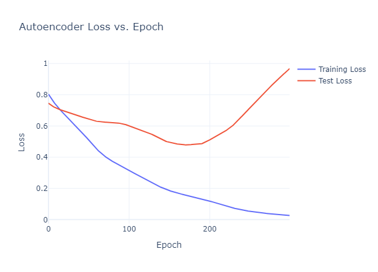
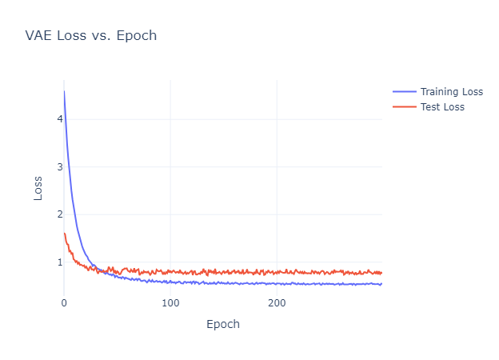

!!! example "Prerequisites"
    - [Deep Learning Setup](./00_setup.md) : Setup workspace and download python libraries

**Learning Objectives**

1. [XXX](#)
2. [XXX](#)

## Autoencoders

### Background

Neural networks can be great at learning patterns in data. But the trade off is that the model can be too good, meaning it essentially memorizes all the training data and is not generalizable to other data - in other words the model is overfit:

!!! info "Model Overfitting"
    <figure markdown="span">
      { width="600" }
      <figcaption>Image Credit: [H2O AI](https://h2o.ai/wiki/overfitting/)</figcaption>
    </figure>

So enter autoencoders! Autoencoders take input from a higher dimensional space and _encode_ it in a lower dimensional space, then _decode_ the output of the latent space and reconstructs the data:

!!! info "Autoencoders"
    <figure markdown="span">
      { width="400" }
      <figcaption></figcaption>
    </figure>


So, why bother - how does this contribute to prevent overfitting? Well, by encoding and decoding the input data we tend to "denoise" our data, allowing the model to learn general patterns without memorizing our data. To assess an autoencoder we use the loss function that makes most sense for our problem. In this tutorial we are going to be predicting smoking status again (a binary variable) so we need the binary cross entropy loss function!

$$
L_{BCE} = - \frac{1}{N} \sum_{i=1}^N [y_i log({\hat{y}_i}) + (1-y_i)log(1- \hat{y}_i)]
$$

- $L_{BCE}$: loss after encoding and decoding
- $N$: number of observations
- $y_i$: true value
- $\hat{y}_i$: predicted value after endcoding and decoding

With a lower $L_{BCE}$, the model is doing a better job of reconstructing the original data! 

### Building an Autoencoder

Let's make ourselves an autoencoder then! We will pull in our glioblastoma data from the classifier example:

```py
# pandas and numpy for data manipulation and plotly for plotting
import pandas as pd
import numpy as np
import plotly.express as px
import plotly.graph_objects as go

# sklearn for model metrics, normalization and data splitting
from sklearn.model_selection import train_test_split
from sklearn.preprocessing import StandardScaler
from sklearn.metrics import accuracy_score, precision_score, recall_score, f1_score

# torch for tensor operations and neural network functions
import torch
from torch.utils.data import DataLoader, TensorDataset
import torch.nn as nn
import torch.optim as optim

# read in data and filter out na values
gbm = pd.read_csv("../data/gbm_data.csv",on_bad_lines='skip')
gbm = gbm[gbm['SMOKING_HISTORY'].notna()]

# make a new column for smoking status
gbm['smoking_status'] = np.where(gbm['SMOKING_HISTORY'].str.contains('non-smoker'), 'non-smoker', 'smoker')

# filter our data for features of interest
gbm_filt = gbm.loc[:,['LINC00159','EFTUD1P1','C20orf202','KRT17P8','RPL7L1P9','smoking_status']]
gbm_filt['smoking_status'] = gbm_filt['smoking_status'].astype('category').cat.codes
```

Now we will split our data into training and test datasets and normalize:

```py
# Split the data into features and outcome variable
X = gbm_filt.drop('smoking_status', axis=1).values
y = gbm_filt['smoking_status'].values

# Normalize the features
scaler = StandardScaler()
X = scaler.fit_transform(X)

# Split the data into training and testing sets
X_train, X_test, y_train, y_test = train_test_split(X, y, test_size=0.2, random_state=81)

# Convert to PyTorch tensors
X_train_tensor = torch.tensor(X_train, dtype=torch.float32)
y_train_tensor = torch.tensor(y_train, dtype=torch.long)
X_test_tensor = torch.tensor(X_test, dtype=torch.float32)
y_test_tensor = torch.tensor(y_test, dtype=torch.long)
```

Great, let's make that autoencoder now!

```py
class AutoEncoder(nn.Module):
    def __init__(self, input_dim, latent_dim):
        super(AutoEncoder, self).__init__()
        # encoder 
        self.encoder = nn.Sequential(
            nn.Linear(input_dim, 64),
            nn.ReLU(),
            nn.Linear(64, latent_dim)
        )
        # decoder 
        self.decoder = nn.Sequential(
            nn.Linear(latent_dim, 64),
            nn.ReLU(),
            nn.Linear(64, 1),
            nn.Sigmoid()

        )
    # define the flow through the nodes
    def forward(self, x):
        latent = self.encoder(x)
        reconstructed = self.decoder(latent)
        return reconstructed
```

Here we:

- Create an autoencoder where the encoder takes our initial inputs
- Sends to two hidden layers with 64 nodes and a ReLU activation function
- Squeezes the input to some latent dimension
- Next in the decoder, we take the input from the latent space and send it to two more layers with the original dimensions of the hidden layers - 64
- Then it outputs probabilities for binary classification!
- Finally, we define how is data going to move through our model - it is encoded by our encoder and then decoded by our decoder.

### Train the Autoencoder 

Let's train our autoencoder and see how well it does!

```py
# get input dimension
input_dim = X_train_tensor.shape[1]

model = AutoEncoder(input_dim=input_dim, latent_dim=2)
criterion = nn.BCELoss()
optimizer = torch.optim.Adam(model.parameters(), lr=0.001)

# convert target tensors to float32
y_train_tensor = y_train_tensor.float()
y_test_tensor = y_test_tensor.float()

# set a list for our training and test loss values
ae_train_loss_vals = []
ae_test_loss_vals = []

# training loop
for epoch in range(300):
    model.train()
    
    # what is our model output and loss
    output = model(X_train_tensor)
    loss = criterion(output.squeeze(), y_train_tensor)

    # clear our gradients, backpropagate and 
    # perform gradient descent
    optimizer.zero_grad()
    loss.backward()
    optimizer.step()

    # loss for each training epoch
    ae_train_loss_vals.append(loss.item())

    # evaluate on test data
    model.eval()
    with torch.inference_mode():
        recon_test = model(X_test_tensor)
        test_loss = criterion(recon_test.squeeze(), y_test_tensor)
        ae_test_loss_vals.append(test_loss.item())
```

You'll see our familiar flow, where we:

- call our model with the our number of input features, and the number of nodes in the latent space
- define our loss function and optimizer
- convert our outcome variables to float values
- loop through our epochs in training mode
- plug and chug our model
- get our loss
- clear our gradients
- backpropogate to update our model weights
- perform gradient descent to find the optimal weights

Now let's see how our loss changes as the number of epochs increases!

```py
# create an empty plot
fig = go.Figure()

# add training and test loss values
fig.add_trace(go.Scatter(x=list(range(300)), y=ae_train_loss_vals, mode='lines', name='Training Loss'))
fig.add_trace(go.Scatter(x=list(range(300)), y=ae_test_loss_vals, mode='lines', name='Test Loss'))

# update labels & layout
fig.update_layout(
    title='Autoencoder Loss vs. Epoch',
    xaxis_title='Epoch',
    yaxis_title='Loss',
    template = 'plotly_white'
)

# show the plot
fig.show()
```

!!! info "output"
    <figure markdown="span">
      { width="400" }
      <figcaption></figcaption>
    </figure>

Great! we see that as the number of epochs increases the loss decreases and that this loss seems to level out after epoch 300.

## Variational Autoencoders (VAE)

### Background

A recent improvement on the autoencoder is the variational autoencoder (VAE). So a normal autoencoder is returning a reconstructed value in an effort to avoid overfitting the model. A VAE will turn the latent space into a distribution instead of a vector by returning two things from the latent space:

- **Mean ($\mu$)**: the central point of the distribution.
- **Log variance $log(\sigma^2)$**: describes how spread out or “wide” the distribution should be around the mean.

Now to get data points they essentially sample from a normal distribution defined by the mean and variance output from the VAE and output another data point $z$: 

$z = \mu + \sigma \odot \epsilon$

Where:

- $\mu$ is the mean
- $\sigma$ is the standard variation (which you get by converting the log variance with $exp(0.5⋅log(\sigma^2))$ )
- $\epsilon$ is the sample from $\mathcal{N}(0,1)$ (a normal distribution with a mean of 0 and a standard deviation of 1)
- $\odot$ is the element wise product

What is cool about this is that we can use variational autoencoders to model the underlying distribution. However, we have an issue, we sampled from a normal distribution $\mathcal{N}(0,1)$ and our latent space has a distribution of $\mathcal{N}(\mu,\sigma^2)$. To make sure we can sample from $\mathcal{N}(0,1)$ we should have some way of penalizing the model if it strays too far from that normal distribution $\mathcal{N}(0,1)$. We do this using Kullback-Leibler (KL) divergence. For a binary loss that is summarized to:

$L_{KL} = -\frac{1}{2} \sum_{j=1}^{d} \left( 1 + \log \sigma_j^2 - \mu_j^2 - \sigma_j^2 \right)$


??? tip "How did we get to this?"
       
    - **What is KL Divergence?**:
    
    - The KL divergence between two distributions $q(z|x)$ and $p(z)$ is:
       
         $L_{KL} = D_{KL}(q(z|x) \parallel p(z)) = \int q(z|x) \log \frac{q(z|x)}{p(z)} \, dz$
         
       - For a VAE, $q(z|x)$ has a mean $\mu$ and a variance $\sigma^2$ (encoded for each input by the encoder network).
    
    - **Plugging in the Standard Normal Distribution**:
    
       - $p(z)$ is a standard normal distribution $N(0, 1)$, so it has the following formula:
       
         $p(z) = \frac{1}{\sqrt{2 \pi}} e^{-\frac{z^2}{2}}$
         
       - $q(z|x)$, has a mean $\mu$ and variance $\sigma^2$, and is a normal distribution for each input sample: $q(z|x) = N(\mu, \sigma^2)$.
    
    - **Solving the KL Divergence Integral**:
    
       - Substituting the expressions for $q(z|x)$ and $p(z)$ into the KL divergence formula, we get:
    
         $L_{KL} = \int N(\mu, \sigma^2) \log \frac{N(\mu, \sigma^2)}{N(0, 1)} \, dz$
         
       - Now if solve our integral we get our KL divergence!:
    
         $L_{KL} = -\frac{1}{2} \sum_{j=1}^{d} \left( 1 + \log \sigma_j^2 - \mu_j^2 - \sigma_j^2 \right)$
         
We can then add this loss to our reconstruction loss to get the loss of our VAE:

$L_{VAE} =  L_{BCE} + \beta L_{KL}$

Where $\beta$ is a term for how much we want to penalize the latent space. Now enough math, let's make a VAE!

### Building a VAE

```py
class VAEClassifier(nn.Module):
    def __init__(self, input_dim, latent_dim):
        super(VAEClassifier, self).__init__()
        
        # encoder: compresses input to a smaller space
        self.encoder = nn.Sequential(
            nn.Linear(input_dim, 64), 
            nn.ReLU() 
        )
        
        # latent space parameters: calculates the mean (mu) and log variance (logvar)
        self.fc_mu = nn.Linear(64, latent_dim)  
        self.fc_logvar = nn.Linear(64, latent_dim) 
        
        # Classifier: Outputs a probability for each binary label (0 or 1)
        # uses a ReLU activation function and
        # sigmoid function to get class probabilities
        self.classifier = nn.Sequential(
            nn.Linear(latent_dim, 64), 
            nn.ReLU(), 
            nn.Linear(64, 1), 
            nn.Sigmoid()  
        )

    # Reparameterization: Samples from the latent distribution
    # using mean (mu) and standard deviation derived from log variance (logvar)
    def reparameterize(self, mu, logvar):
        # get standard deviation
        std = torch.exp(0.5 * logvar)
        # sample from a normal distribution
        eps = torch.randn_like(std)
        # output a sampled point 
        return mu + eps * std  

    # Forward pass: Defines data flow through the network
    def forward(self, x):
        # encode the input
        encoded = self.encoder(x)
        # calcluate the mean and log variance of the latent space
        mu = self.fc_mu(encoded)  
        logvar = self.fc_logvar(encoded)
        # sample points from latent space
        z = self.reparameterize(mu, logvar)
        # classify samples and return the output, mean and log variance
        output = self.classifier(z)  
        return output, mu, logvar  
```
​
Here is what is going on:

- **Encoder:** Compresses the input into latent space.
- **Latent Space Parameters:** Calculates the mean (mu) and log variance (logvar) for the latent space.
- **Classifier:** Uses a linear layer, ReLU, and sigmoid to produce a probability, predicting the binary class (e.g., 0 or 1).
- **Reparameterization:** Samples from the latent distribution, turning logvar into standard deviation and adding random value from normal distribution $\mathcal{N}(0,1)$.
- **Forward Pass:** Passes data through the encoder, computes mean and log variance, and then reparameterizes to get a sample point.
- **Sampling:** Combines mean with a standard deviation-scaled data point to produce z, a point in the latent space.
- **Binary Classification:** Uses z to predict a binary outcome, outputting a probability with the sigmoid activation.
- **Outputs:** Returns the probability, along with mean and log variance (which we will need to calcualte the KL divergence!).

### Train a VAE

Let's get to training our new VAE!

```py
# call our model and set the number of dimensions for the input and
# latent space
vae = VAEClassifier(input_dim=X_train_tensor.shape[1], latent_dim=2)
optimizer = torch.optim.Adam(vae.parameters(), lr=0.001)

# define our VAE loss using the reconstructed loss value
# the mean and log variance
def vae_loss(recon_x, x, mu, logvar):
    recon_loss = nn.BCELoss()(recon_x.squeeze(), x)
    kl_divergence = -0.5 * torch.sum(1 + logvar - mu.pow(2) - logvar.exp())
    return recon_loss + kl_divergence

vae_train_loss_vals = []
vae_test_loss_vals = []

# loop through and train the VAE
for epoch in range(300):
    vae.train()

    # grab out reconstruction loss, mean and log variance
    recon, mu, logvar = vae(X_train_tensor)
    # calcluate our loss
    loss = vae_loss(recon, y_train_tensor, mu, logvar)

    # clear our gradients, backpropagate and 
    # perform gradient descent
    optimizer.zero_grad()
    loss.backward()
    optimizer.step()

    # append to list
    vae_train_loss_vals.append(loss.item())

    # evaluate on test data
    vae.eval()
    with torch.inference_mode():
        recon_test, mu_test, logvar_test = vae(X_test_tensor)
        test_loss = vae_loss(recon_test, y_test_tensor, mu_test, logvar_test)
        vae_test_loss_vals.append(test_loss.item())
```

Here we are:

- Defining our loss function and optimizer.
- Defining a function to calculate our VAE loss using our reconstructed loss value, the mean and log variance.
- Setting a training loop and calculating our loss.
- Clearing our gradients, backpropogating and running gradient descent
- Adding that loss to our list of losses
- Evaluating our model on test data and adding the test loss to our list

Let's see how our VAE did with our test and training data!

```py
# create an empty plot
fig = go.Figure()

# add training and test loss values
fig.add_trace(go.Scatter(x=list(range(300)), y=vae_train_loss_vals, mode='lines', name='Training Loss'))
fig.add_trace(go.Scatter(x=list(range(300)), y=vae_test_loss_vals, mode='lines', name='Test Loss'))

# update labels & layout
fig.update_layout(
    title='VAE Loss vs. Epoch',
    xaxis_title='Epoch',
    yaxis_title='Loss',
    template = 'plotly_white'
)

# show the plot
fig.show()
```

!!! info "output"
    <figure markdown="span">
      { width="400" }
      <figcaption></figcaption>
    </figure>


**Key Points**
