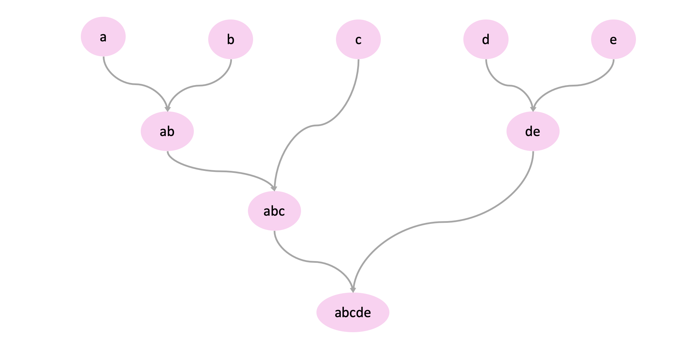

## Agglomerative Hierarchical Clustering

Agglomerative Hierarchical Clustering is a bottom up approach wherein observations are their own cluster and then merged into larger and larger clusters until their is one root cluster:



This "hierarchical" view of these clusters is called a dendrogram. Here we will discuss Ward's Method for merging these clusters as it is one of the most popular:

$$D_{12} = \frac{||\overline{x_1} - \overline{x_2}||^2}{\frac{1}{N_1}+\frac{1}{N_2}}$$

!!! example "Explanation of Terms" 

    - $D_{12}$ distance between clusters 1 and 2
    - $N_1$ number of points in cluster 1
    - $N_2$ number of points in cluster 2
    - $\overline{x_1}$ mean of cluster 1
    - $\overline{x_2}$ mean of cluster 2

## Pre-Processing

Before we apply k-means we will need to create our distance matrix:

```R
# load the libraries
.libPaths(c("/cluster/tufts/hpc/tools/R/4.0.0"))
library(tidyverse)
library(factoextra)

# load our counts data
counts <- read.csv(
  file="data/gbm_cptac_2021/data_mrna_seq_fpkm.txt",
  header = T,
  sep = "\t")

# make the genes our rownames
rownames(counts) <- make.names(counts$Hugo_Symbol,unique = TRUE)

# remove the gene symbol column
counts <- counts %>%
  select(-c(Hugo_Symbol)) 

# log2 transform our data 
# transpose our data so that our patients are rows
counts <- t(log2(counts + 1))

# Change NA counts to 0
counts[!is.finite(counts)] <- 0

# generate correlation distance matrix
dist <- get_dist(counts,method = "pearson")

# plot correlation distance matrix
fviz_dist(dist) +
  theme(axis.text = element_text(size = 3)) +
  labs(
    title = "Pearson Correlation Distances Between Samples",
    fill = "Pearson Correlation"
  )
```


## Clustering with Ward's method

Let's apply this in R!

```R
# apply ward's clustering
hc <- hclust(d = dist, method = "ward.D2")

# visualizing the dendrogram
# and color by k number of clusters
fviz_dend(hc,
          k = 4, 
          k_colors = c("#1B9E77", "#D95F02", "#7570B3", "#E7298A"))
```


!!! info
    - here we see each sample starts as its own cluster and is gradually merged into larger clusters
    - we choose to visualize 4 clusters by this is really up to your discretion

## Hierarchical Clustering Shortcomings

Hierarchical clustering does come with a few issues:

!!! warning "Hierarchical Clustering Shortcomings"

    - Hierarchical clustering is computationally expensive and is much slower than the k-means algorithm
    - While this method is less sensitive to the shape of the data, given it starts generating clusters from individual data points; The dendrogram can be difficult to interpret and where to draw the line with cluster membership is not necessarily defined.

## References

1. [Clustering Distance Measures](https://www.datanovia.com/en/lessons/clustering-distance-measures/)
2. [K-Means Clustering in R: Algorithm and Practical Examples](https://www.datanovia.com/en/lessons/k-means-clustering-in-r-algorith-and-practical-examples/)
3. [Agglomerative Hierarchical Clustering](https://www.datanovia.com/en/lessons/agglomerative-hierarchical-clustering/)
4. [Distance Method Formulas](https://www.jmp.com/support/help/14/distance-method-formulas.shtml#177809%C2%A0)
5. [Hierarchical Clustering — Explained](https://towardsdatascience.com/hierarchical-clustering-explained-e58d2f936323)
