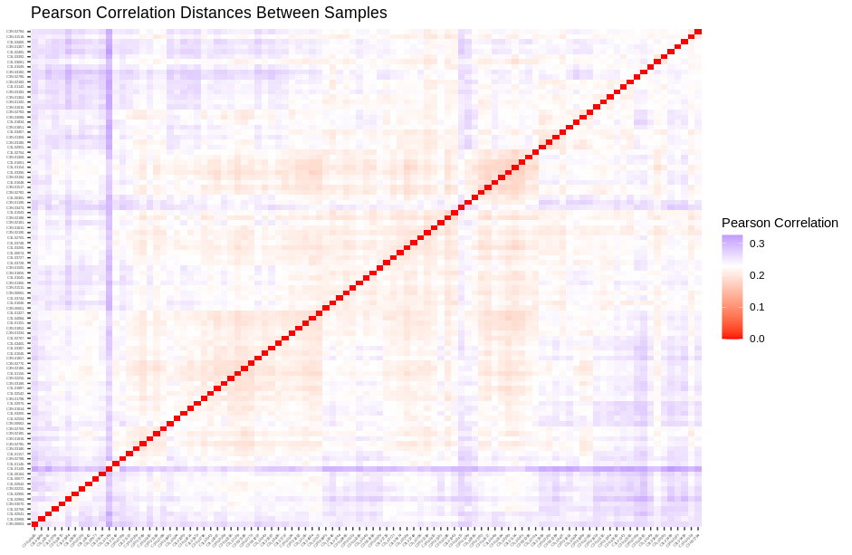

## K-means Clustering 

K-means clustering seeks to derive $k$ number of clusters so that the variation within the cluster is minimized. Additionally, the number of clusters, $k$, is specified by the user. The standard k-means algorithm is the Hartigan-Wong algorithm, which starts by determining the sum of squares for each cluster:

$$W(C_k) = \sum_{x_i\in{C_k}}{(x_i - \mu_k)^2}$$
    
Then the total within cluster variation is calculated by:

$$total\ within\ cluster\ variation = \sum_{k=1}^k{\sum_{x_i\in{C_k}}{(x_i - \mu_k)^2}}$$

!!! example "Explanation of Terms"

    - $C_k$ cluster number $k$
    - $x_i$ point in cluster $C_k$
    - $\mu_k$ mean of points in cluster $C_k$
    - $k$ number of clusters
    
!!! info
    This total within cluster variation is then minimized to best assign data points to the $k$ number of clusters

## Pre-Processing

Before we apply k-means we will need to create our distance matrix:

```R
# load the libraries
.libPaths(c("/cluster/tufts/hpc/tools/R/4.0.0"))
library(tidyverse)
library(factoextra)

# load our counts data
counts <- read.csv(
  file="data/gbm_cptac_2021/data_mrna_seq_fpkm.txt",
  header = T,
  sep = "\t")

# make the genes our rownames
rownames(counts) <- make.names(counts$Hugo_Symbol,unique = TRUE)

# remove the gene symbol column
counts <- counts %>%
  select(-c(Hugo_Symbol)) 

# log2 transform our data 
# transpose our data so that our patients are rows
counts <- t(log2(counts + 1))

# Change NA counts to 0
counts[!is.finite(counts)] <- 0

# generate correlation distance matrix
dist <- get_dist(counts,method = "pearson")

# plot correlation distance matrix
fviz_dist(dist) +
  theme(axis.text = element_text(size = 3)) +
  labs(
    title = "Pearson Correlation Distances Between Samples",
    fill = "Pearson Correlation"
  )
```



## Choosing K Number of Clusters

In R we can use the `fviz_nbclust()` to determine the optimal number of clusters. This will generate a plot and where the plot dips dramatically is our optimal number of $k$!

```R
# k-means clustering
# choosing k
fviz_nbclust(counts, kmeans, method = "wss") +
  geom_point(color="midnightblue")+
  geom_line(color="midnightblue")+
  geom_vline(xintercept = 3,color="firebrick")
```


Here we do not see a drastic dip in our plot so we will choose 3 clusters here.

## Applying K-means

We will now perform k-means clustering and plot the results!

```R
# applying the k-means function
km <- kmeans(counts, 3, nstart = 25)
fviz_cluster(km, 
             counts,
             geom = "point",
             ellipse.type = "norm")+
  theme_bw()+
  labs(
    title = "K-means Cluster Plot with 3 Clusters"
  )
```


You will note here that the clusters overlap to a great degree and there isn't great separation between them.

## K-means Shortcomings

Given the lackluster cluster plot above it is worth discussing the shortcomings of k-means clustering:

!!! warning "K-means Shortcomings"
    - you are going to need to determine the optimal number of clusters ahead of time
    - the initial center point is chosen at random! And as such your cluster can change depending on that random center point
    - this approach can rely heavily on the mean of the cluster points and the mean is sensitive to outliers in the data!
    - k-means clustering can be affected by data order as well

## References
1. [Clustering Distance Measures](https://www.datanovia.com/en/lessons/clustering-distance-measures/)
2. [K-Means Clustering in R: Algorithm and Practical Examples](https://www.datanovia.com/en/lessons/k-means-clustering-in-r-algorith-and-practical-examples/)
