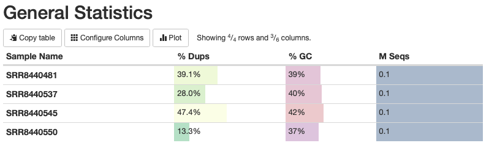
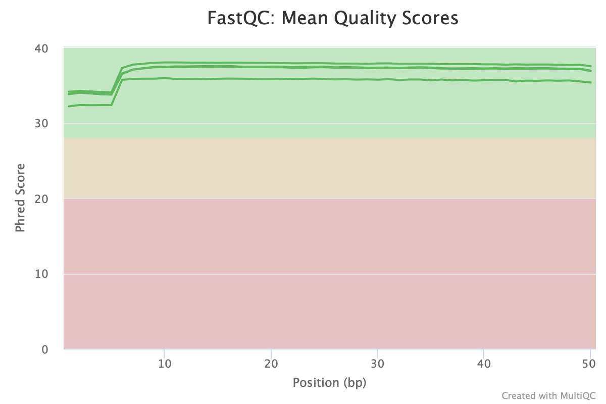

## FASTQ Format

The sequencing data we will be looking at is composed of reads, or short nucleotide sequences. Read information is stored in FASTQ files:

!!! info "[FASTQ Format](https://www.drive5.com/usearch/manual7/fastq_files.html)"

    
   
   
Here we see that for each read there are four lines:

- sequence label
- nucleotide sequence
- a separator
- quality score string

## Quality Scores

Quality scores are a score representing the probability that a base was called in error. A common score used is the Phred Score:

|Phred Quality Score	|Probability of incorrect base call	|Base call accuracy|
|-|-|-|-
|10	|1 in 10|	90%|
|20	|1 in 100|	99%|
|30	|1 in 1000|	99.9%|
|40	|1 in 10,000|	99.99%|
|50	|1 in 100,000|	99.999%|
|60	|1 in 1,000,000|	99.9999%|

Typically, we would like the bases in our sequence to have a quality score higher than 20, meaning that there was a 1 in 100 chance the base was called in error.

## Quality Control

To check quality scores (and a few other metrics), we can use a tool called FastQC. Let's make a script:

```sh
nano initial_qc.sh
```

!!! info "inital_qc.sh"

    ```sh
    #!/bin/bash
        
    # Step 1: Perform quality control using FastQC
    mkdir qc_output/initial_qc
    fastqc -o qc_output/initial_qc/ data/*.fastq.gz
        
    # Step 2: Aggregate quality control results using MultiQC
    multiqc qc_output/initial_qc -o qc_output/initial_qc --title "Raw Data QC Report"
        
    echo "Initial Quality Control Comlete!"
    ```

To check out the intial quality control report go to `qc_output/initial_qc/` and open the file `Raw-Data-QC-Report_multiqc_report.html`. Here you will see a number of plots:

!!! info "General Statistics: columns for samples, the percent of duplicated sequences, gc content, number of sequences (in million) per sample"

    

!!! info "Sequence Counts: Sequence counts for each sample. Duplicate read counts are an estimate only."

    
    
!!! info "Sequence Quality Histograms: The mean quality value across each base position in the read."

    
    
!!! info "Per Sequence Quality Scores: The number of reads with average quality scores. Shows if a subset of reads has poor quality."

    
    
!!! info "Per Sequence GC Content: The average GC content of reads. Normal random library typically have a roughly normal distribution of GC content."

    
    
!!! info "Per Base N Content: The percentage of base calls at each position for which an N was called."

    
    
!!! info "Sequence Duplication Levels: The relative level of duplication found for every sequence. "

    

!!! info "Overrepresented sequences: The total amount of overrepresented sequences found in each library."

    
    
!!! info "Adapter Content: The cumulative percentage count of the proportion of your library which has seen each of the adapter sequences at each position."

    
    
  
## Read Trimming

!!! info "trimming.sh"

    ```sh
    #!/bin/bash
    
    # Step 3: Trim data using Trim Galore
    mkdir qc_output/trimmed_qc
    for file in ./data/*.fastq.gz; do
        trim_galore --output_dir ./trimmed_output $file --fastqc --fastqc_args "-o ./qc_output/trimmed_qc"
    done

    # quality control on trimmed
    multiqc qc_output/trimmed_qc -o qc_output/trimmed_qc/ --title "Trimmed Data QC Report" 
    
    echo "Input Data Has Been Trimmed!"
    ```
    
    
## References

1. [Base-Calling of Automated Sequencer Traces Using Phred. II. Error Probabilities](https://genome.cshlp.org/content/8/3/186.full)
2. [Quality Control](https://training.galaxyproject.org/training-material/topics/sequence-analysis/tutorials/quality-control/tutorial.html)
