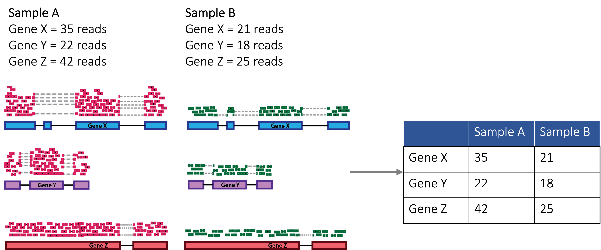
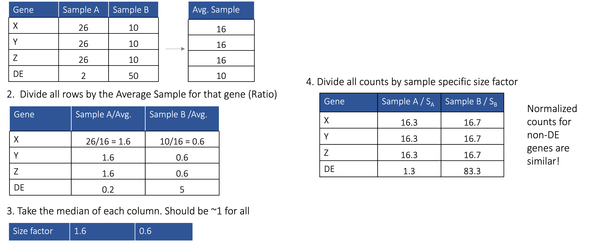

## Differential Expression

So far we have taken sequencing reads, removed poor quality sequences/adapters, aligned these reads to a reference genome, and counted the aligned reads based on whether or not they mapped to a gene/feature. What we are now left with is a counts table:

!!! info "Reads To Counts - [Adapted from HBC DGE Workshop](https://hbctraining.github.io/DGE_workshop)" 

    

We will now take these counts and use a differential expression tool, DESeq2, to normalize our data to ensure that our counts are not biased by things like gene length, sequencing depth, etc. DESeq2 normalizes gene experssion data using the following procedure: 


!!! info "DESeq2 Normalization" 

    
    
DESeq2 also builds a regression model to assess if the slope between two conditions is different. This essentially will tell us, is the gene expression in one group (Alzheimer's patients) higher/lower than another group of patients (Control patients):

!!! info "DESeq2 Regression Modelling" 

    

DESeq2 then will test if this slope is 0 (meaning no difference between Control and AD) or not 0 (meaning there is a difference between Control and AD) with the Wald statistic. This statistic will then be compared to a normal distribution to get a p-value!

!!! info "DESeq2 Wald Statistic" 

    

## Loading/Cleaning Data

We will now be working with R to analyze our data! So open RStudio and navigate to the folder `rna_seq_pipeline`. In that folder create a script called `differential_expresson.R`. We will start by adding the following to the script:

```R
# --- Load Libraries -----------------------------------------------------------
library(tidyverse)         # data manipulation/plotting
library(DESeq2)            # differential expression
library(EnhancedVolcano)   # creating volcano plots
library(ggpubr)            # publication ready plotting
library(clusterProfiler)   # enrichment analysis 
```

Now we need to some data cleaning. Our featureCounts table has gene information from the gtf file as the first few columns. This will need to be moved to a separate data frame. Additionally, our column names are currently the full name of the bam file. We will be removing the extra characters from these column names. Finally we will make sure our counts data and meta data have a matching sample order:

```R
# --- Load Data  ---------------------------------------------------------------

# load meta data 
meta <- read.csv(
  file = "./path/to/rna_seq_pipeline/data/meta.txt",
  sep="\t"
)

# load featureCounts output
fc_counts <- read.csv(
  file = "./path/to/rna_seq_pipeline/featurecounts_output/featurecounts_results.txt",
  sep = "\t",
  skip = 1)

# isolate the feature data and clean up gene name column
features <- fc_counts %>%
  dplyr::select(names(fc_counts)[!grepl(".bam",names(fc_counts))]) %>%
  mutate(Gene=gsub("gene-","",Geneid))

# isolate the counts data 
counts <- fc_counts %>%
  dplyr::select(names(fc_counts)[grepl(".bam",names(fc_counts))])

# clean up names to remove file name info
names(counts) <- gsub(
  "alignment_output.|_trimmed_Aligned.sortedByCoord.out.bam",
  "",
  names(counts))

# order counts columns to match meta data
counts <- counts[,meta$ID]

# make the genes the rownames:
counts <- cbind(data.frame(Gene=features$Gene),counts)
```

## Pre-Processing

Before we get started with DESeq2 we are going to filter out genes with all zero counts and factor our condition variable (Control v. AD). By factoring we specify there is an order to our condition variable with Control being the base:

```R
# --- Pre-Processing -----------------------------------------------------------

# remove genes with all zero counts:
counts <- counts %>%
  filter(apply(counts[,-1],1,sum) != 0)

# factor our column of interest
meta$Diagnosis <- factor(
  meta$Diagnosis,
  levels = c("Control","AD")
)
```

## Differential Expression

We will be applying a fairly standard DESeq2 pipeline, where we:

- create a DESeqDataSet from the counts and meta data
- specify the model formula Control v. AD
- run DESeq2
- shrink the log2FoldChanges to account for differences in standard error
- convert our results to a data frame

```R
# --- Differential Expression --------------------------------------------------
# create DESeq2 object
dds <- DESeqDataSetFromMatrix(countData=counts, 
                              colData=meta, 
                              design=~Diagnosis,
                              tidy = TRUE)

# run DESeq2 on data
dds <- DESeq(dds)

message("Differential Expression Analysis Complete")

# shrink the log2 fold changes
res <- lfcShrink(dds=dds, coef=2, type="apeglm")

# convert to a data frame
res <- data.frame(res)
```

## Volcano Plot

To plot our differentially expressed genes, or DEGs, we will use a volcano plot or a plot of log2 fold change versus the -log10 of the p-value where genes towards the top are more significant:

```R
# --- Volcano Plot -------------------------------------------------------------

# use the EnhancedVolcano library to plot our differentially expressed genes
EnhancedVolcano::EnhancedVolcano(
  toptable = res,                                          # name of results df
  x = "log2FoldChange",                                    # name of log2FC column
  y="pvalue",                                              # name of p-value column
  pCutoff = .1,                                            # p-value cutoff
  FCcutoff = 1e-06,                                        # fold change cutoff
  xlim = c(                                                # x axis limits
    min(res$log2FoldChange)*1.25,
    max(res$log2FoldChange)*1.25),
  ylim = c(0,                                              # y axis limits
           -log10(min(res$pvalue))*1.25),                 
  lab=rownames(res),                                       # gene names                     
  title = "Volcano Plot",                                  # title
  subtitle = "Differential Expression of AD RNA-Seq Data") # subtitle
```


!!! info "Volcano Plot"

    
    
## PCA Plot

PCA or Principal Component Analysis is a way of visualizing the variation in high dimensional data in just a few dimensions. For more information, check out [our tutorial on PCA](../../../machine_learning/unsupervised/dimension-reduction.md). Let's examine the variation in our gene expression data and color by disease status:

```R
# --- PCA Plot -----------------------------------------------------------------

# perform variance stabilization for pca
rld <- rlog(dds, blind=FALSE)

# plot pca plot 
plotPCA(object = rld,               # variance stabilized counts data
        intgroup=c("Diagnosis")) +  # variable to color by
  ggpubr::theme_pubr(               # ggplot theme to use
    legend = "right"                # where to put the legend
  )+
  labs(
    color="Diagnosis"               # legend color title
  )
```


!!! info "PCA Plot"

    
    
    
## Top DEG Expression

Often times we may want to visualize the expression of our top differentially expressed genes. We can do this using a violin plot!

```R
# --- Top DEG Expression -------------------------------------------------------

# grab the top DEG
top_deg <- res %>%
  arrange(pvalue) %>%
  slice_head(n=1) %>%
  rownames()

# plot this gene's expression split by your condition variable
ggpubr::ggviolin(
  data=meta %>%
    mutate(top_deg=assay(rld)[top_deg,]),
  x="Diagnosis",
  y="top_deg",
  fill="Diagnosis",
  color="Diagnosis",
  palette = "npg",
  xlab="",
  ylab = top_deg
)
```

!!! info "Top DEG Plot"

    
    
    
## Enrichment Analysis

Our most significant DEGs often represent some biological change. We can better understand the biology behind our gene list by first filtering by some significance threshold (usually an adjusted p-value of 0.05, however given how subsampled our data is we are setting a p-value cutoff of .2) and then running an overrepresentation test on genes that are associated with some gene ontology term. Here we use clusterProfiler to perform gene ontology enrichment!
 
```R
# --- ClusterProfiler Enrichment -----------------------------------------------

# enrich significant degs
enriched <- enrichGO(
  gene = res %>%                   # significant degs that pass some threshold
    dplyr::filter(pvalue < .2) %>%
    rownames(),
  OrgDb = 'org.Hs.eg.db',          # organism your samples belong to
  keyType = "SYMBOL",              # type of gene name
  ont = "ALL",                     # enrichment ontology
  pvalueCutoff = 0.1,              # pvalue cutoff
  pAdjustMethod = "none",          # pvalue adjustment method
  universe = rownames(dds),        # what other genes did you test?
  qvalueCutoff = 0.2,              # qvalue cutoff
  minGSSize = 2,                   # minimum number of genes per term
  maxGSSize = 800                  # maxiumum number of genes per term
)

# plot enrichment
enrichplot::dotplot(
  object = enriched,           # enrichment object
  x='Count',                   # x-axis 
  showCategory = 10,           # how many terms to sho
  size='Count',                # what to size by
  color ="p.adjust")+          # what to color by
  scale_color_gradient(
    low="midnightblue",        # change colors of dotplot
    high="thistle"
  )+
  labs(                         
    size="Count",              # change size legend title
    color="Adjusted P-Value"   # change color legend title
  )
```


!!! info "Enrichment DotPlot"

    
    
    
## References

1. [HBC DGE Workshop](https://hbctraining.github.io/DGE_workshop)
2. [Differential expression analysis for sequence count data](https://genomebiology.biomedcentral.com/articles/10.1186/gb-2010-11-10-r106)
