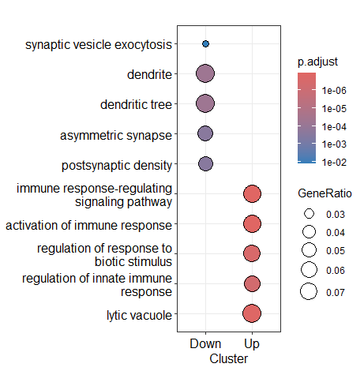
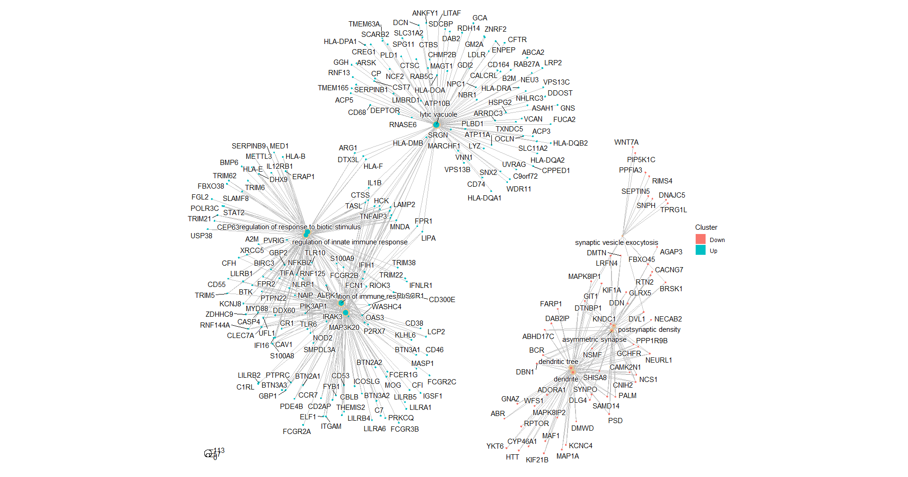
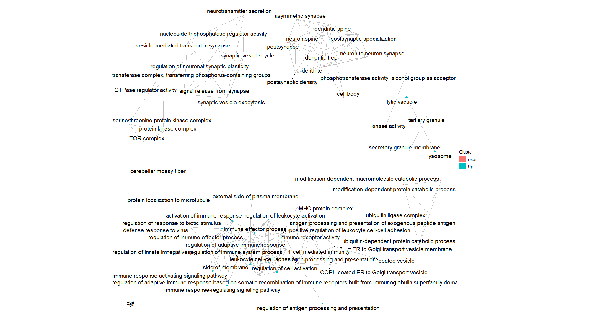

# Pathway Analysis

## What is pathway or functional enrichment analysis?

Pathways analysis helps us understand the biological functions and networks affected by your differentially expressed genes (DEGs). Instead of looking at individual genes in isolation, we look at groups of genes that work together in known biological processes.


## How is this done?

Typically, you examine the overlap between your DEGs and sets of genes with known biological functions. If the overlap is greater than expected by chance you can say that your DEGs are enriched for genes related to that pathway. You can compare your DEGs to different databases of gene sets (KEGG, GO, Reactome, etc.). At it's simplist implementation you can just examine the overlap between your DEGs and your own gene set if you have one!

In the differential expression tutorial we looked at DEGs between Alzheimer's disease and control, then we ended with GO enrichment results. Let's dig a little deeper into those results.

## Load Libraries/Data

```{r}
library(tidyverse)         # data manipulation/plotting
library(clusterProfiler)   # enrichment analysis 
library(enrichplot)        # enrichment analysis 
```

```{r}
# Download Data
download.file(
  url="https://github.com/comp-tox-jhu/CompToxLab/raw/refs/heads/main/docs/omics/transcriptomics/enrichment_analysis/data/enrich.rds",
  destfile = "../results/pathway.Rmd"
)
enrich <- readRDS("../results/pathway.Rmd")
```


## Overview of what the data looks like

Before we dive into analysis, let's understand what we're looking at. From your differential expression analysis, you should have an enrichment object, where the tabular results are stored in:

```{r}
enrich@compareClusterResult
```

```{md}
Cluster direction ONTOLOGY         ID                                            Description
1    Down      Down       BP GO:0016079                            synaptic vesicle exocytosis
2    Down      Down       BP GO:0019941       modification-dependent protein catabolic process
3    Down      Down       BP GO:0043632 modification-dependent macromolecule catabolic process
4    Down      Down       BP GO:0006511          ubiquitin-dependent protein catabolic process
5    Down      Down       BP GO:0099504                                 synaptic vesicle cycle
6    Down      Down       BP GO:0035372                    protein localization to microtubule
  GeneRatio   BgRatio RichFactor FoldEnrichment   zScore       pvalue   p.adjust     qvalue
1    13/480 104/18525 0.12500000       4.824219 6.378409 2.885855e-06 0.01242649 0.01204769
2    40/480 735/18525 0.05442177       2.100340 4.964691 8.449113e-06 0.01421305 0.01377978
3    40/480 740/18525 0.05405405       2.086149 4.917991 9.902265e-06 0.01421305 0.01377978
4    39/480 724/18525 0.05386740       2.078945 4.830099 1.387601e-05 0.01471859 0.01426991
5    18/480 219/18525 0.08219178       3.172089 5.273665 1.709079e-05 0.01471859 0.01426991
6     5/480  19/18525 0.26315789      10.156250 6.512500 9.845234e-05 0.07065596 0.06850210
geneID                                 Count
1    DVL1/DIAPH1/MAP1A/ABHD17C/GAS2L1  13
2    DVL1/DIAPH1/MAP1A/ABHD17C/GAS2L1  40
3    DVL1/DIAPH1/MAP1A/ABHD17C/GAS2L1  40
4    DVL1/DIAPH1/MAP1A/ABHD17C/GAS2L1  39
5    MAP1A/ABHD17C/GAS2L1...           18
6    DVL1/DIAPH1/...                    5                                                
```

Your significant DEGs likely show one of two patterns:

**Upregulated genes** (log2FoldChange > 0): More active in your condition of interest (e.g., AD)
**Downregulated genes** (log2FoldChange < 0): Less active in your condition of interest

You will also see some additional columns:

- `Cluster` + `direction` - Start here. Group by cluster to see coordinated functional themes. Check direction to see if they're up or down
- `Count` and `GeneRatio` - See how many of your genes are involved and the proportion
- `p.adjust` - Determine if enrichment is statistically significant (< 0.05)
- `Description` - Understand what the pathway does biologically
- `geneID` - See which specific genes are involved and validate they make biological sense for your condition


## Plotting Enrichment Results

We have several options for plotting pathways, one option is a dotplot. The x axis is the group, in this case direction, the y axis is the process, the dots are sized by the gene ratio, and then colored by the signficance level:

```{r}
dotplot(enrich)
```



We can also create a CNET plot, where the nodes are genes and pathways, and the links between them show us which genes drive different enrichment terms.

```{r}
cnetplot(enrich)
```



Some pathways are driven by similar genes, so we can examine the overlap in genes between terms using the emapplot, where the nodes are enrichment terms and the links between them represent gene overlap. This is useful in identifying redundant terms.

```{r}
enrich <- enrich |> 
  pairwise_termsim()

emapplot(enrich)
```


## Protein-Protein Interaction Networks

Databases like STRING are useful for identifying connections between DEGs. We can examine a STRING Network for the downregulated genes by copying this into [STRINGDB](https://string-db.org/cgi/input?&input_page_active_form=multiple_identifiers):

```{r}
enrich@compareClusterResult |> 
  filter(direction=="Down") |> 
  separate_rows(geneID,sep="/") |> 
  pull(geneID) |> 
  unique() |> 
  paste(collapse = ",")
```


```{md}
DVL1,TPRG1L,WNT7A,FBXO45,DTNBP1,GIT1,PIP5K1C,PPFIA3,BRSK1,SNPH,RIMS4,DNAJC5,SEPTIN5,PARK7,HECTD3,UBE2F,BAP1,BAG6,RNF8,FBXL18,UBE2D4,VPS37D,AGAP3,MAPKAP1,ZER1,FBXW5,ARRB1,WNT10B,ULK1,DCAF11,MAP1A,STUB1,TRAF7,NTAN1,MAPK3,FBXL19,FBXO31,CHMP1A,LRRC75A,KCTD2,ANAPC11,FEM1A,LONP1,FBXO27,DMAC2,CHMP4B,UBE2L3,KCTD17,DESI1,BCAP31,UBL4A,DGKQ,CTBP1,CLTB,BTBD9,DIAPH1,ABHD17C,GAS2L1,DBN1,NSMF,NEURL1,HRAS,JPH3,DLG4,SHISA8,KIF1A,DAB2IP,KNDC1,FARP1,PPP1R9B,CARM1,MAPK8IP2,NDP,PRKCZ,KCNC4,ADORA1,FBXO41,RPS6KA2,CNIH2,CYP46A1,BEGAIN,ABR,KCNN1,CACNG7,DLGAP4,BCR,RAB11FIP3,PARD6A,CAMK2N1,KIF21B,HTT,WFS1,SYNPO,YKT6,MAF1,NCS1,PSD,MAPK8IP1,DDN,GLRX5,GCHFR,NECAB2,SAMD14,RPTOR,PALM,DMWD,GNAZ,DMTN,LRFN4,RTN2,LIMK1,GRK2,EEF2,UBE2M,PDXP,CCNY,CCNK,TRAF3,MLST8,TBKBP1,CDKN2D,ERCC2,CDK16,AKAP14,NFIB,GLUL,TTBK1,CREB3,ASS1,VTI1B,RNF157,NF2,WDTC1,TMEM183A,TMEM183BP,MEGF8,CBX6,TAF6,USP22,ATXN7L3,PIK3R2,POLR3H,TAF7L,PRR5,NUDT3,DGKZ,GNB1,GNG7,GNA11,GNG14,SLC29A4,DENND1A,OLFM2,MRAS,PPP1R3G,PPP1R3F,MICOS10,UQCRH,TOMM40L,SLC41A3,LETM1,SLC25A31,COX7C,HIGD2A,PDSS2,MRPS24,MIGA2,SURF1,PMPCA,NDUFB8,SLC25A22,TIMM10,COX8A,TMEM126A,NGRN,COX4I1,COASY,MRPL12,SLC25A23,FKBP8,C19orf12,FAM210B,ATP5F1E,GCAT,SLC25A6,CDIP1,CENPS,CENPX,MEPCE,HEXIM1,NOL9,MAST2,AK4,ETNK2,GUK1,KHK,STK25,TNK2,GRK6,GCK,FASTK,TESK1,STKLD1,CKB,SBK1,PIP4K2B,PLK5,CSNK1G2,MAP3K10,PANK2,PDXK,MAP3K15,DENND4B,ARHGEF4,MON1A,TBC1D22B,ADAP1,AGFG2,RASA4B,RASA4,TBC1D13,GPSM1,RASGEF1A,HPS1,SERGEF,ARHGDIG,SGSM2,RUNDC3A,TBCD,PPP1R16A,PPP1R12C,PPP1R16B,ENTREP3,SHISA5,PMEPA1,WBP2NL,REEP2,TAFA5,HMGA1,ZMIZ2,SMARCD3,SMARCC2,DTX1,PUS1,CAMTA2,MED24,CRTC1
```
