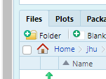
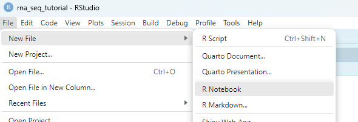
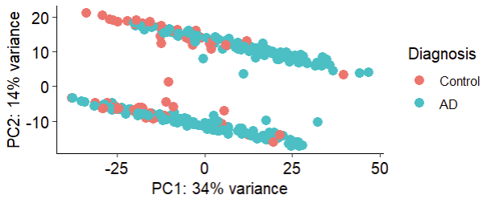
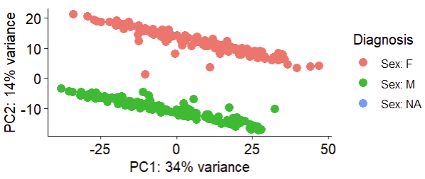
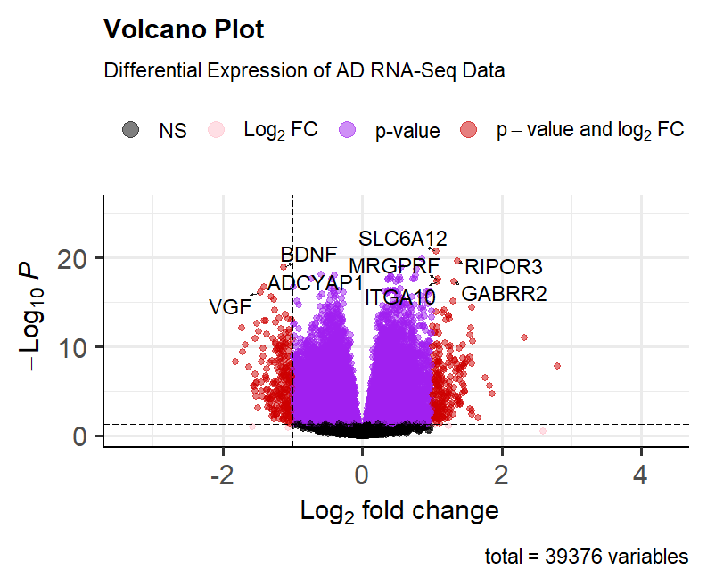
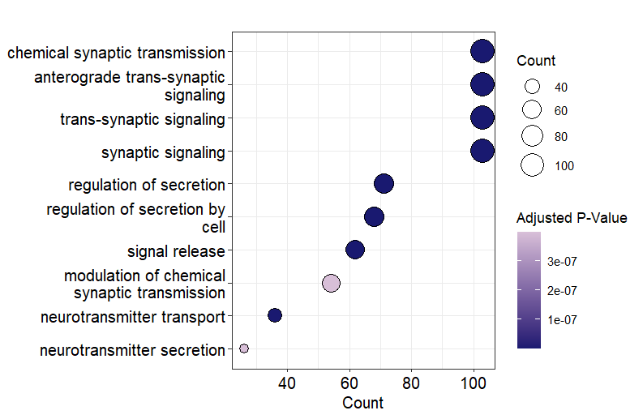

# Differential Expression Tutorial

## Setup

First thing is first we need a folder to work with! Open RStudio and create a folder by clicking the folder button:

!!! info "Where can I find the folder button?"
    

Now call this folder `rna_seq_tutorial`! Click inside this folder and create a few more folders:

1. `data`
2. `scripts`
3. `results`

Now let's make sure all the packages we need are installed:

```R
# Install CRAN packages
install.packages(c("tidyverse", "R.utils", "EnhancedVolcano", "ggpubr"))

# Install Bioconductor manager if needed
if (!requireNamespace("BiocManager", quietly = TRUE))
  install.packages("BiocManager")

# Install Bioconductor packages
BiocManager::install(c("DESeq2", "clusterProfiler", "org.Hs.eg.db"))
```

Great now in console we will download our count data and meta data!

```R
download.file("https://www.ncbi.nlm.nih.gov/geo/download/?type=rnaseq_counts&acc=GSE125583&format=file&file=GSE125583_raw_counts_GRCh38.p13_NCBI.tsv.gz",destfile = "data/count_data.tsv.gz")
```
Now we will unzip this file using the `gunzip` function from `R.utils`. If you don't have `R.utils` go ahead and install using `install.packages("R.utils")`.

```R
R.utils::gunzip("data/count_data.tsv.gz")
```
Great, now let's get our meta data:

```R
download.file("https://raw.githubusercontent.com/comp-tox-jhu/CompToxLab/refs/heads/main/docs/omics/transcriptomics/rna_seq/data/meta.csv",destfile = "data/meta.csv")
```

Now our annotation data:

```R
download.file("https://www.ncbi.nlm.nih.gov/geo/download/?format=file&type=rnaseq_counts&file=Human.GRCh38.p13.annot.tsv.gz",destfile = "data/annot.tsv.gz")
```

And we will uncompress it:

```R
R.utils::gunzip("data/annot.tsv.gz")
```

Wonderful, now that we have both we can get to work! Let's create a script by going to create a new script by going to `File` > `New File` > `R Notebook`:

!!! info "How can I create a new script?"
    

When we create a new R markdown there is some helpful text to get you going, let's delete that until all you see is:

```
---
title: "R Notebook"
output: html_notebook
---
```

Now let's change that title to "RNA-seq Tutorial". To start we need to make some headers to guide what we will do. We make headers by using hashtags `#` and the more hashtags the smaller the header. Let's make the following:

```
## Loading/Cleaning Data
## Pre-Processing
## Principal Component Analysis 
## Differential Expression
## Volcano Plots
## Functional Enrichment
```

Great! now under `## Setup` we will make a code chunk and we can do this using the short cut `Cntrl+Alt+I` or `Cmd+Alt+I` on a Mac. in that chunk we will load our libraries:

```R
library(tidyverse)         # data manipulation/plotting
library(DESeq2)            # differential expression
library(EnhancedVolcano)   # creating volcano plots
library(ggpubr)            # publication ready plotting
library(clusterProfiler)   # enrichment analysis 
```
Wonderful with this we can start bringing in data to play with!

## Loading/Cleaning Data

To load our data we will be pulling from the `readr` package from the `tidyverse`. So make another code chunk under `## Setup`:

```R
counts <- readr::read_tsv("../data/count_data.tsv")
meta <- readr::read_csv("../data/meta.csv")
annot <- readr::read_tsv("../data/annot.tsv")
```

If you'll notice, we don't have gene names in our first column of our counts data frame. So we need to map it to our annotation file:

```R
# remove the first column
counts_clean <- counts |> 
  column_to_rownames("GeneID") 
```

So what we did here is we took the counts data frame, and made the `GeneID` column the row names. Now let's clean up our meta data:

```R
# remove the first column
meta_clean <- meta |> 
  column_to_rownames("geo_accession")
```
Now we have our GEO accession number as our rownames, this ensures that the row names of our meta data match the column names of our counts data! But we still need to make sure everything is in the same order:

```R
# reoder meta data to match the order of the counts data
meta_clean <- meta_clean[match(colnames(counts_clean), rownames(meta_clean)), ]

# ensure the order is the same
all(rownames(meta_clean) == colnames(counts_clean))
```

Great! if this says `TRUE` that means the order of our samples is the same for both the count and meta data! Now let's make a column in our meta data to define our groups:

```R
# add in a variable for condition
meta_clean <- meta_clean |> 
  mutate(condition = case_when(
    grepl("AD", title) ~ "AD",
    grepl("CON ", title) ~ "Control"
  )) |> 
  mutate(condition = factor(condition,levels=c("Control", "AD")))
```

Here we say we are creating a new column `condition`, and when another column, `title` has the pattern `AD` we put `AD` as the value, and if the pattern `CON` is found, we put `Control`.

## Principal Component Analysis 

Now we are going to store our data in a DESeqDataSet object, this is essentially a fancy list object where we can conveniently hold our data. 

```R
# create DESeq2 object
dds <- DESeqDataSetFromMatrix(countData=counts_clean, 
                              colData=meta_clean, 
                              design=~condition)
```

Nice what we have done is taken count data and a meta data file, defined our formula (~ condition, which is testing for differences between control samples and Alzheimer's disease samples). Before we move forward, let's check the grouping in our dataset. To do this we will use principal component analysis where we generate several linearly uncorrelated components that help us to visualize the variation in our data:

```R
# perform variance stabilization for pca
vst <- vst(dds, blind=FALSE)

# plot pca plot 
plotPCA(object = vst,               # variance stabilized counts data
        intgroup=c("condition")) +  # variable to color by
  ggpubr::theme_pubr(               # ggplot theme to use
    legend = "right"                # where to put the legend
  )+
  labs(
    color="Diagnosis"               # legend color title
  )
```

!!! info "PCA Plot by Condition"
    

Hmmm, this is concerning, there are two very obvious groups in our data, that seem to have nothing to do with diagnosis! Any thoughts what this could be? Well this next PCA plot may shed some light on that:

```R
# plot pca plot 
plotPCA(object = vst,                           # variance stabilized counts data
        intgroup=c("characteristics_ch1.4")) +  # variable to color by
  ggpubr::theme_pubr(                           # ggplot theme to use
    legend = "right"                            # where to put the legend
  )+
  labs(
    color="Diagnosis"                           # legend color title
  )
```

!!! info "PCA Plot by Sex"
    

This tells us that sex seems to drive alot of the variation in our dataset. So we should add this as a covariate in our model!

## Differential Expression

Ok onto the fun part, let's do differential expression! We will be using DESeq2 to perform differential expression and find genes that are differentially expressed between Alzheimer's disease and controls, while accounting for variation due to sex.

```R
# create DESeq2 object
dds <- DESeqDataSetFromMatrix(countData=counts_clean, 
                              colData=meta_clean, 
                              design=~condition+characteristics_ch1.4)

# run DESeq2 on data
dds <- DESeq(dds)

# convert results to a data frame
res <- data.frame(results(dds))
```

Nice what we have done is taken count data and a meta data file, defined our formula (~ condition + characteristics_ch1.4), performed differential expression, and collected our results as a data.frame! However, if you click on the results, you'll notice that `GeneID` isn't super informative! They are just numbers. To get gene names we will need to map it back to our annotation file:

```R
# add gene names to the results
res_mapped <- res |>
  mutate(GeneID=rownames(res)) |>
  mutate(GeneID=as.character(GeneID)) |>
  inner_join(annot |> 
               mutate(GeneID=as.character(GeneID)),
             by="GeneID")
```

Here we took our results made a column named `GeneID` converted it to a character for mapping,  joined this data frame with the annotation data frame where we also converted the `GeneID` to a character value, and mapped on the `GeneID` column. 

## Volcano Plots

Now that we have mapped our `GeneID` to the annotation data frame, we can visualize our top differentially expressed genes or DEGs:

```R
# use the EnhancedVolcano library to plot our differentially expressed genes
EnhancedVolcano::EnhancedVolcano(
  toptable = res_mapped,                                   # name of results df
  x = "log2FoldChange",                                    # name of log2FC column
  y="padj",                                                # name of p-value column
  pCutoff = 0.05,                                          # p-value cutoff
  FCcutoff = log2(2),                                      # fold change cutoff
  lab=res_mapped$Symbol,                                   # gene names                     
  title = "Volcano Plot",                                  # title
  col = c('black', 'pink', 'purple', 'red3'),              # pallete colors
  drawConnectors = TRUE,                                   # box the labels
  subtitle = "Differential Expression of AD RNA-Seq Data") # subtitle
```

!!! info "Volcano Plot of DEGs"
    

Nice! Here we see that GABA receptors, growth factors and integrins appear differentially expressed in Alzheimer's disease samples. 

## Functional Enrichment Analysis

Now individual genes are great but what do these genes represent? For this, we need functional enrichment analysis where we determine if our set of DEGs overlap with gene sets with known functions. We will use `clusterProfiler` to run this analysis!

```R
# enrich significant degs
enrich <- enrichGO(
  gene = res_mapped |>             # significant degs that pass threshold
    filter(padj < 0.05) |> 
    filter(abs(log2FoldChange) > log(2)) |>
    pull(Symbol),
  OrgDb = 'org.Hs.eg.db',          # organism your samples belong to
  keyType = "SYMBOL",              # type of gene name
  ont = "ALL",                     # enrichment ontology
  pvalueCutoff = 0.1,              # pvalue cutoff
  pAdjustMethod = "fdr",           # pvalue adjustment method
  universe = res_mapped$Symbol,    # what other genes did you test?
  qvalueCutoff = 0.2,              # qvalue cutoff
  minGSSize = 2,                   # minimum number of genes per term
  maxGSSize = 800                  # maxiumum number of genes per term
)
```

Now we can visualize these results with a dotplot where the x axis is the number of genes that overlap the y axis is the description and the size of the dots represents the number of genes that overlap and the color represents the p-value:

```R
dotplot(
    object = enrich,             # enrichment object
    x='Count',                   # x-axis 
    showCategory = 10,           # how many terms to sho
    size='Count',                # what to size by
    color ="p.adjust")+          # what to color by
    scale_fill_gradient(
        low="midnightblue",      # change colors of dotplot
        high="thistle"
    )+
    labs(                         
        size="Count",            # change size legend title
        fill="Adjusted P-Value"  # change color legend title
    )
```

!!! info "Dotplot of Enriched Terms"
    

Here we see that terms related to synaptic signaling and neurotransmitter mechanics are dysregulated in Alzheimer's disease. 

## References

1. [HBC DGE Workshop](https://hbctraining.github.io/DGE_workshop)
2. [Differential expression analysis for sequence count data](https://genomebiology.biomedcentral.com/articles/10.1186/gb-2010-11-10-r106)
